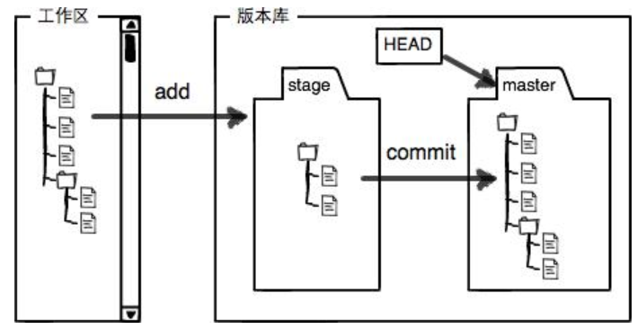
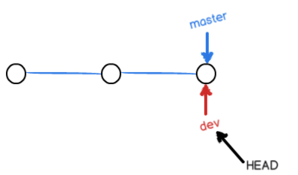
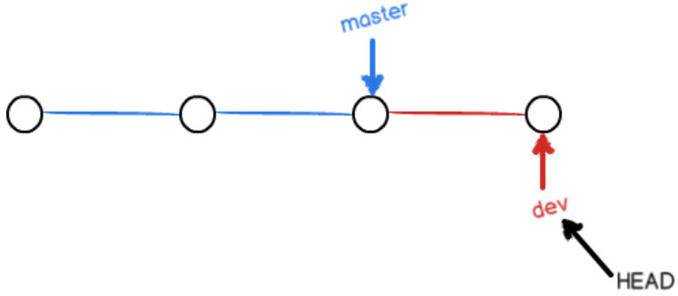
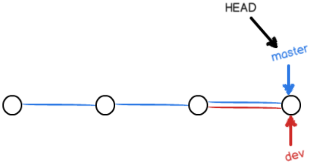

#### 新建当前目录到git库

`git init`

#### 添加和标注修改原因

`git add filename`

`git commit -m "comment"`

#### 查看文件修改记录

`git diff filename`

#### 查看当前库的所有提交历史版本

`git log --pretty=oneline`

`git reflog` 用来记录每一次命令

#### **切换版本**

- 回退上一个版本

  `git reset --hard HEAD^`

- 切换到任意一个版本

  `git reset --hard commit_id`

#### **如何实现远程版本回退**

首先本地版本库回退，强制推送到远程分支

git push -f origin master

#### **如何舍弃修改**

- 舍弃工作区的修改

  `git checkout -- filename`

- 舍弃暂存区stage的修改

  `git reset HEAD filename`

- 舍弃已经提交的修改

  只能回退版本，`git reset  --hard commid_id`

#### **分支命令**

- 创建分支

  `git checkout -b dev`

  -b 表示创建并切换等价于

  `git branch dev `

  `git checkout dev`

- 列出所有分支

  `git branch`

  `git checkou dev `       切换到dev分支

- 将dev分支的工作合并到master分支上去(快进模式)

  `git merge dev`

- 删除分支

  `git branch -d dev`

#### 远程库

- 配置ssh keys

  https://blog.csdn.net/Suo_ivy/article/details/79940839

- 关联一个远程库

  `git remote add origin git@github.com:softmapplen/JAVAProject.git`

- 关联后使用命令第一次推送master分支的所有内容

  `git push -u origin master`

- 推送最新修改

  `git push origin master`

- 使用`git pull` 更新本地文件

#### 如何完全删除一个本地库

只需要把创建本地库文件夹下的隐藏文件.git文件夹删除

#### git的22端口被禁用怎么办？

打开~/.ssh/config 

加入 

Host github.com

Hostname ssh.github.com

Port 443