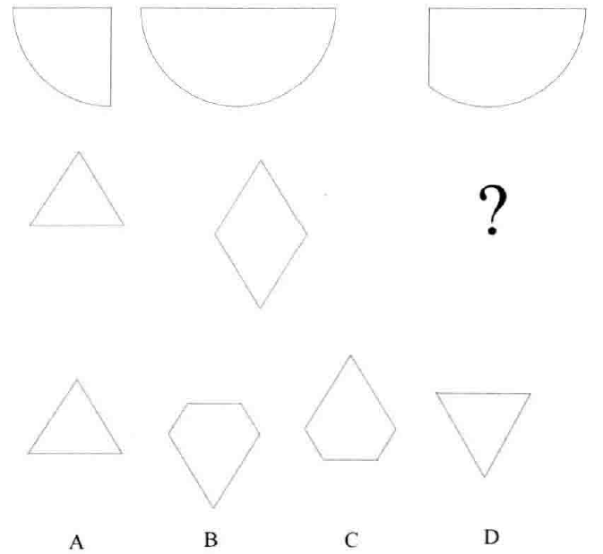
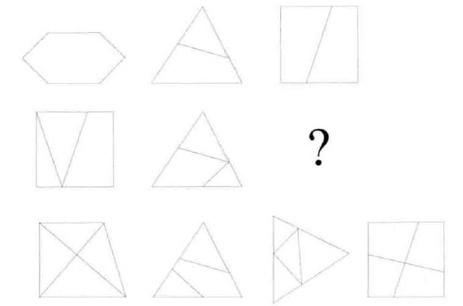
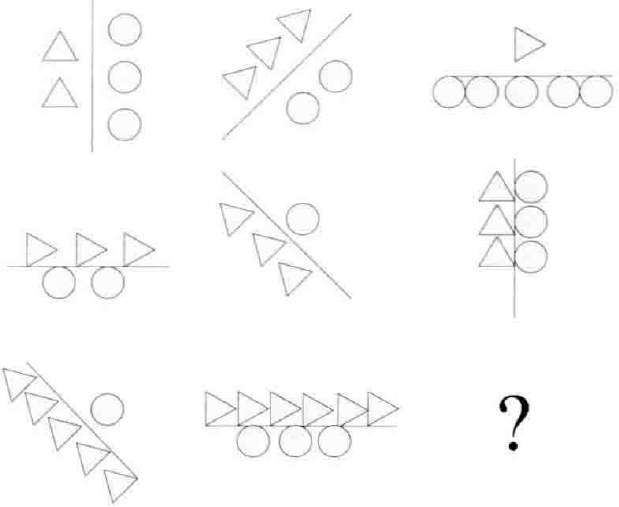
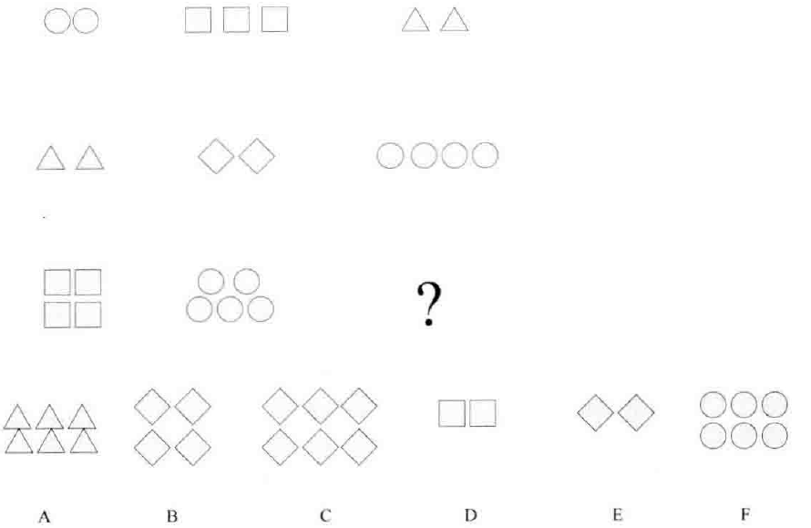
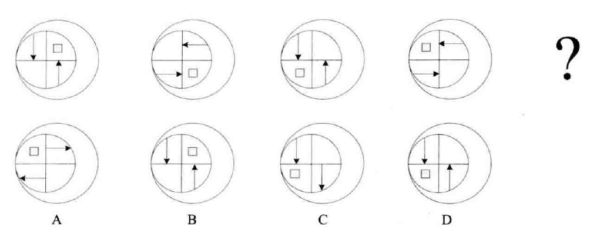
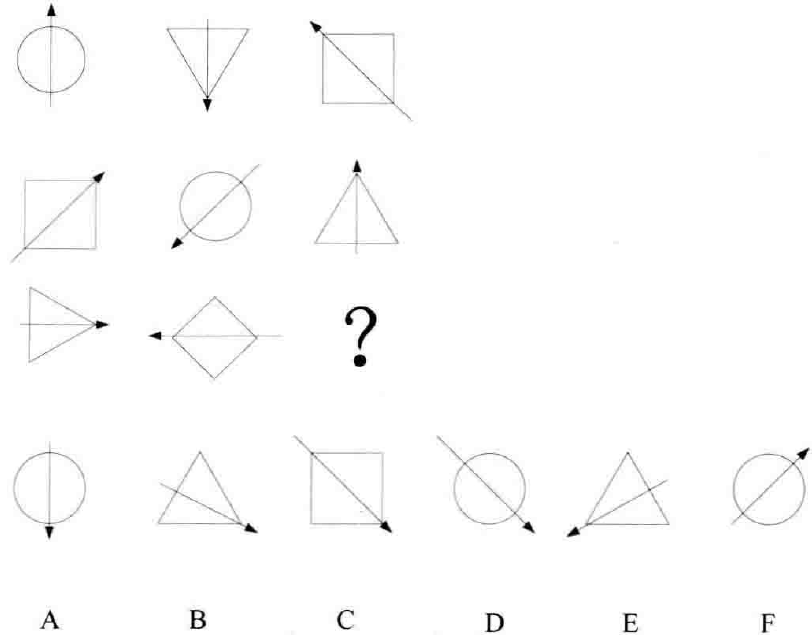
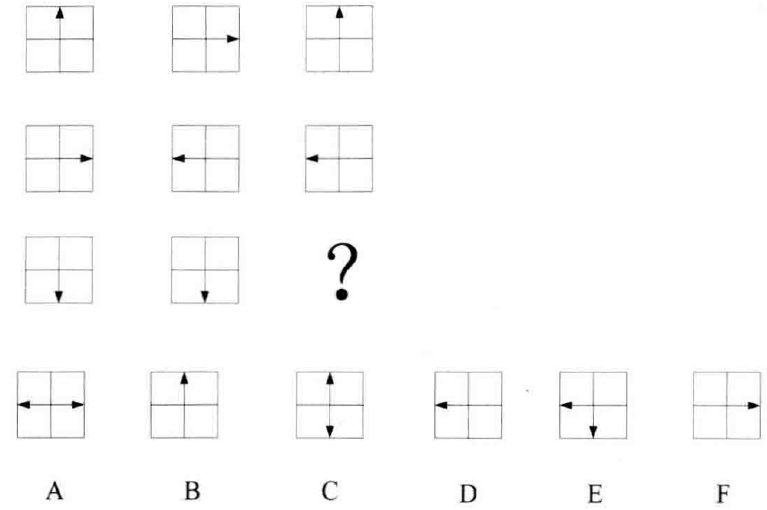
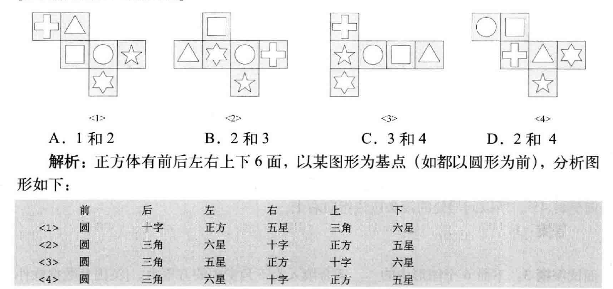

由于银行会为每一个环节进行打分，那么非技术类题目也有必要进行一定的总结，才能取得不错的分数。非技术类题目主要分为数字类题目、图表类题目以及智力类题目。下面将常用的解题思路进行总结整理，以便后续复习使用。

# 数字类题目

## 数字规律类题目

先看**数列的整体趋势**，是上升还是下降，然后通过某个或某组数字的变化，找到问题的突破口。其次还要熟悉题目的**常见规律**，数字规律主要有：

等差关系、等比关系、前项求和/差关系类、前项求积/商关系类、隔项规律类、分组规律类、平方规律类、质数规律、整数加小数类、组合类

### 等差关系

- 23 28 32 35 ？  answer：37
- 24 44 68 96 128 ？  44-24=20=4x5，68-44=4x6... answer：128+4x9=164

### 等比关系

> 9，16，37，?，289 

16-9=7 37-16=7x3 100-37=7x9 289-100=7x27

### 前项和

> 0,1,1,2,4,7,13,?

0+1+1=2 1+1+2=4 ...某一项等于前几项的和！

### 前项求积

> 3,4,6,12,36,?

3x4/2=6 4x6/2=12.. 前项求积关系类

### 隔项规律类

> 34,36,35,35,36,34,37,?

### 平方规律类

> 65,35,17,3,?

8x8+1=65 6x6-1=35 4x4+1=17 2x2-1=3 0x0+1=1

### 质数规律

> 6,10,14,22,?

6=2x3 10=2x5 14=2x7 22=2x11 2x13=26

### 整数加小数类

> 1.01,3.02,9.03,27.05,81.08,?

小数和整理的规律分开看，就一步了然了。

### 组合类

> 0,6,24,60,120,？

2^3-2=6 3^3-3=24 4^3-4=60 本题是一道等差关系和立方关系的组合

# 图形类题目分析

## 图形形状变化

图形组合

形状之差

边的笔画数

> T V X    ->2条线
>
> Z H A   ->3条线
>
> M E ?   ->4条线

## 图形数量的变化

根据每一列的三角关系以及每一行的圆的关系，就可以得到答案了。

组合规律，每一行的形状各不相同，同一列的最后一个数量等于前两个之和。

## 图形旋转变化

每一列的箭头顺时针旋转45°

每一行的箭头有两个方向是相同的，每一列的箭头都不相同。

# 表格分析类题目

