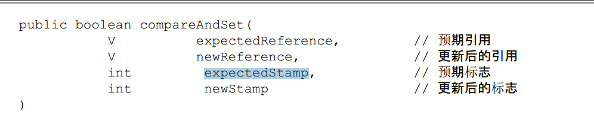
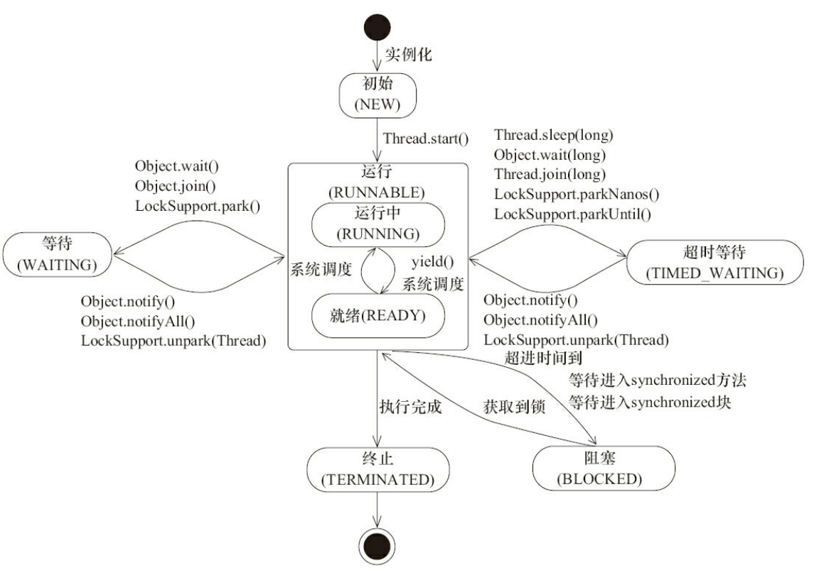
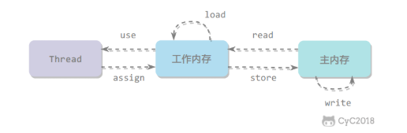
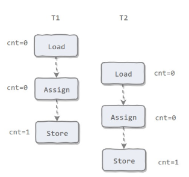

并发与多线程（应用及底层实现）

- [x] <u>线程的创建方式</u>
- [ ] 多线程应用场景
- [x] <u>线程状态与转换</u>
- [ ] 线程安全与同步机制：volatile vs synchronized vs Lock(ReentrantLock)
- [ ] volatile底层原理
- [x] synchronized底层原理及其锁的升级与降级
- [ ] Lock(ReentrantLock)底层原理
- [x] <u>ThreadLocal</u>
- [x] 线程通信
- [ ] 线程池（底层实现）
- [ ] 死锁的出现场景、定位以及修复
- [ ] CAS 与 Atomic类型实现原理
- [x] AQS：并发包基础技术
- [ ] Java并发包（java.util.concurrent及其子包）提供的并发工具类
  - 比synchronized更加高级的各种同步结构，如：Semaphore，CyclicBarrier， CountDownLatch
  - 各种线程安全的容器（主要有四类：Queue,List,Set，Map），如：ConcurrentHashMap,ConcurrentSkipListMap,CopyOnWriteArrayList
  - 各种并发队列的实现，如各种BlockingQueue的实现（ArrayBlockingQueue, LinkedBlockingQueue, SynchorousQueue, PriorityBlockingQueue,DelayQueue,LinkedTranferQueue）等。
  - Executor框架与线程池


# 并发编程

## 上下切换

CPU通过时间片分配算法来循环执行任务，当前任务执行一个时间片后会切换到下一个任务。但是，在切换前会保存上一个任务的状态，以便下次切换回这个任务时，可以再加载这个任务的状态。**任务从保存到再加载的过程就是一次上下文切换。**

线程有创建和上下文切换的开销。

减少上下文切换的开销的方法有：

- 无锁并发编程，例如将数据的ID按照Hash算法取模分段，不同的线程处理不同段的数据
- CAS算法
- 使用最少线程和使用协程，在单线程里实现多任务的调度，并在单线程里维持多个任务间的切换

## 无同步方案

### 栈封闭

局部变量是存储在虚拟机栈中的，而虚拟机栈是线程私有的，不会出现线程安全问题。

### 线程本地存储（Thread Local Storage）

如果一段代码中所需要的数据必须与其他代码共享，那就看看这些**共享数据的代码是否能保证在同一个线程中执行**。如果能保证，我们就可以把共享数据的可见范围限制在同一个线程之内，这样，无须同步也能保证线程之间不出现数据争用的问题。

一个应用实例就是经典 Web 交互模型中的“一个请求对应一个服务器线程”（Thread-per-Request）的处理方式，这种处理方式的广泛应用使得很多 Web 服务端应用都可以使用线程本地存储来解决线程安全问题。

可以使用 java.lang.ThreadLocal 类来实现线程本地存储功能

每个 Thread 都有一个 ThreadLocal.ThreadLocalMap 对象。

当调用一个 ThreadLocal 的 set(T value) 方法时，先得到当前线程的 ThreadLocalMap 对象，然后将 ThreadLocal->value 键值对插入到该 Map 中。

在一些场景 (尤其是使用线程池) 下，由于 ThreadLocal.ThreadLocalMap 的底层数据结构导致 ThreadLocal 有内存泄漏的情况，应该**尽可能在每次使用 ThreadLocal 后手动调用 remove()**，以避免出现 ThreadLocal 经典的内存泄漏甚至是造成自身业务混乱的风险。

## 锁的优化 

锁优化主要是指 JVM 对 synchronized 的优化。

### 自旋锁

互斥同步进入阻塞状态的开销都很大，应该尽量避免。在许多应用中，共享数据的锁定状态只会持续很短的一段时间。自旋锁的思想是让一个线程在请求一个共享数据的锁时执行忙循环（自旋）一段时间，如果在这段时间内能获得锁，就可以避免进入阻塞状态。

自旋锁虽然能避免进入阻塞状态从而减少开销，但是它需要进行忙循环操作占用 CPU 时间，它只适用于共享数据的锁定状态很短的场景。

在 JDK 1.6 中引入了自适应的自旋锁。自适应意味着自旋的次数不再固定了，而是由前一次在同一个锁上的自旋次数及锁的拥有者的状态来决定。

### 锁消除

堆上的数据可能出现永远只有一个线程在访问的情况，即这块内存不存在多线程竞争访问的情况。可以进行锁消除

锁消除主要是通过逃逸分析来支持，如果堆上的共享数据不可能逃逸出去被其它线程访问到，那么就可以把它们当成私有数据对待，也就可以将它们的锁进行消除。

### 锁粗化

如果一系列的连续操作都对同一个对象反复加锁和解锁，频繁的加锁操作就会导致性能损耗。

如果虚拟机探测到由这样的一串零碎的操作都对同一个对象加锁，将会把加锁的范围扩展（粗化）到整个操作序列的外部。

### 锁的状态

为了减少获得锁带来的性能消耗，引入了“偏向锁”和“轻量级锁”。在Java1.6中锁一共有4种状态，级别从低到高分别是：无锁状态、偏向锁状态、轻量级锁状态、重量级锁状态。

锁可以升级但不能降级，目的是为了提高获得锁和释放锁的效率

#### 偏向锁

为了让线程获得锁的代价更低而引入了偏向锁。默认启用，但是是在应用程序启动几秒钟以后才激活。使用`-XX:BiasedLockingStartupDelay=0`来调整激活时间，使用`XX:UseBiasedLocking=false`来关闭偏向锁。

当一个线程访问同步块并获取锁是，会在**对象头和栈帧中的锁记录里存储锁偏向的进程ID**，以后该进程在进入和退出同步块时不需要进行CAS操作来加锁和解锁，只需要简单地测试一下**对象的头的Mark Word**是否存储着指向当前线程的偏向锁。如果测试成功，表示线程已经获得了锁，否则需要再测试一下Mark Word偏向锁的标识是否设置成1：如果没有设置，则使用CAS竞争锁；否则尝试使用CAS将对象头的偏向锁指向当前线程。

偏向锁是一种**等到竞争出现才释放锁的机制**。如果CAS获取偏向锁失败，则表示有竞争。当到达全局安全点（safepoint）时获得偏向锁的线程被挂起，偏向锁升级为轻量级锁，然后被阻塞在安全点的线程继续往下执行同步代码。（撤销偏向锁的时候会导致stop the word）

#### 轻量级锁

线程在执行同步块之前，JVM会先在当前线程的栈帧中创建用于**存储锁记录的空间**，并将对象头中的Mark Word复制到锁记录中（Displaced Mark Word）。然后线程尝试使用**CAS将对象头的Mark Word替换**为指向锁记录的指针。如果替换成功，当前线程获得锁，如果失败，表示其他线程竞争锁，当前线程便尝试使用**自旋来获取锁**。

#### 重量级锁

轻量级解锁时，会使用原子的CAS操作将Displaced Mark Word替换回到对象头上，如果成功，则表示没有竞争发生。如果失败，表示当前锁存在竞争，锁就会膨胀成重量级锁。

当锁处于这个状态，其他线程试图获取锁时，都会被阻塞住，当持有锁的进程放锁之后唤醒这些线程，被唤醒的线程进行新一轮的夺锁。

| 锁       |                             优点                             |                       缺点                       |               适用场景               |
| -------- | :----------------------------------------------------------: | :----------------------------------------------: | :----------------------------------: |
| 偏向锁   | 加锁和解锁不需要额外的消耗，和执行非同步方法比仅存在纳秒级的差距。 | 如果线程间存在锁竞争，会带来额外的锁撤销的消耗。 |  适用于只有一个线程访问同步块场景。  |
| 轻量级锁 |          竞争的线程不会阻塞，提高了程序的响应速度。          |  如果始终得不到锁竞争的线程使用自旋会消耗CPU。   | 追求响应时间。同步块执行速度非常快。 |
| 重量级锁 |              线程竞争不使用自旋，不会消耗CPU。               |             线程阻塞，响应时间缓慢。             |   追求吞吐量。同步块执行速度较长。   |

## 读写锁

同一时刻允许多个线程访问，但是写线程访问时，所有的读线程和其他写线程均被阻塞。

Java并发包提供读写锁的实现是ReentrantReadWriteLock。readLock()方法和writeLock（）方法

依赖自定义同步器来实现。读写状态就是同步器的同步状态，只有用一个整型变量上维护多种状态：高16位读，低16位写。通过位运算来确定读写状态，写状态将高16位全部抹去，读状态等于无符号右移16位

#### 写锁的获取与释放

写锁是一个支持重进入的排他锁。如果当前线程已经获取了写锁，则**增加写状态**。如果当前线程获取写锁时，读锁已被获取或者已经被其他线程获取写锁，则当前线程**进入等待状态**。

~~~java
        protected final boolean tryAcquire(int acquires) {
            /*
             * Walkthrough:
             * 1. If read count nonzero or write count nonzero
             *    and owner is a different thread, fail.
             * 2. If count would saturate, fail. (This can only
             *    happen if count is already nonzero.)
             * 3. Otherwise, this thread is eligible for lock if
             *    it is either a reentrant acquire or
             *    queue policy allows it. If so, update state
             *    and set owner.
             */
            Thread current = Thread.currentThread();
            int c = getState();
            int w = exclusiveCount(c);
            if (c != 0) {
                // (Note: if c != 0 and w == 0 then shared count != 0)
                if (w == 0 || current != getExclusiveOwnerThread())
                    return false;
                if (w + exclusiveCount(acquires) > MAX_COUNT)
                    throw new Error("Maximum lock count exceeded");
                // Reentrant acquire
                setState(c + acquires);
                return true;
            }
            if (writerShouldBlock() ||
                !compareAndSetState(c, c + acquires))
                return false;
            setExclusiveOwnerThread(current);
            return true;
        }
~~~

#### 读锁的获取与释放

读锁是个支持重进入的共享锁。在没有其他写进程访问时，读锁总会被成功被访问。

#### 锁降级

锁降级指把持住（当前拥有的写锁），再次获取到读锁，随后释放（先前拥有的）写锁的过程。

但不支持写锁，因为如果读锁已被多个线程获取，其中任意线程成功获取了写锁并更新了数据，则其更新对其他获取读锁的线程是不可见的。

## CAS

Compare and Swap：CAS操作需要输入两个数值，一个旧值和一个新值，在操作期间先比较旧值有没有发生变化，如果没有发生变化，才交换成新值，发生变化则不交换。

JVM中的CAS操作利用了处理器提供的CMPXCHG指令实现的。

## 原子操作

**使用循环CAS实现原子操作的三大问题**

- ABA问题。如果一个原来是A，变成了B，又变成了C，那么使用CAS进行检查时会发现它的值没有发生变化，但是实际上发生变化了。解决思路：**使用版本号，在变量前面追加上版本号，**每次更新变量的时候把版本号加1，那么A-B-A就会变成1A-2B-3A。JDK的Atomic包提供了一个类AtomicStampedReference来解决ABA问题。

  

- 循环时间长开销大。自旋CAS如果长时间不成功，会给CPU带来非常大的执行开销。pause指令

- 只能保证一个共享变量的原子操作。可以使用锁，除此之外还可以把多个共享变量合成一个共享变量来操作。JDK提供AtomicReference类来保证对象引用之间的原子性。

**使用锁机制实现原子操作**

锁机制保证了只有获得锁的线程才能够操作锁定的内存区域。除了偏向锁，JVM实现锁的方式都用了循环CAS，即当一个线程想进入同步块的时候使用循环CAS的方式来获取锁，当它退出同步块的时候使用循环CAS释放锁。

# 线程的状态与转换



## *NEW*

初始状态，线程被构建，但是还没有调用start（）方法

## *Runnable*

可能在运行，也可能在等待CPU时间片

包含操作系统的Running和Ready状态

## *Blocked*

获取一个排他锁，如果其线程释放了锁就会结束此状态。线程阻塞在synchronized关键字修饰的方法或代码块时的状态。

> 但是java.current包中Lock接口的线程状态却是等待状态，因为java.current包中的Lock接口对于阻塞的实现均使用了LockSupport类中的方法。

## *WAITING*

等待状态，表示当前线程需要等待其他线程做一些特定的动作

| 进入方法                                   | 退出方法                             |
| :----------------------------------------- | ------------------------------------ |
| 没有设置 Timeout 参数的 Object.wait() 方法 | Object.notify() / Object.notifyAll() |
| 没有设置 Timeout 参数的 Thread.join() 方法 | 被调用的线程执行完毕                 |
| LockSupport.park() 方法                    | LockSupport.unpark(Thread)           |

## *TIME_WAITING*

超时等待状态，可以在指定的时间自行返回。无需等待其它线程显式地唤醒，在一定时间之后会被系统自动唤醒。

调用 Thread.sleep() 方法使线程进入限期等待状态时，常常用“使一个线程睡眠”进行描述。

调用 Object.wait() 方法使线程进入限期等待或者无限期等待时，常常用“挂起一个线程”进行描述。

睡眠和挂起是用来描述行为，而阻塞和等待用来描述状态。

阻塞和等待的区别在于，阻塞是被动的，它是在等待获取一个排它锁。而等待是主动的，通过调用 Thread.sleep() 和 Object.wait() 等方法进入。

| 进入方法                                 | 退出方法                                        |
| ---------------------------------------- | ----------------------------------------------- |
| Thread.sleep() 方法                      | 时间结束                                        |
| 设置了 Timeout 参数的 Object.wait() 方法 | 时间结束 / Object.notify() / Object.notifyAll() |
| 设置了 Timeout 参数的 Thread.join() 方法 | 时间结束 / 被调用的线程执行完毕                 |
| LockSupport.parkNanos() 方法             | LockSupport.unpark(Thread)                      |
| LockSupport.parkUntil() 方法             | LockSupport.unpark(Thread)                      |

## *TERMINATED*

终止状态，表示当前线程已经执行完毕

# 线程通信

当多个线程可以一起工作去解决某个问题时，如果某些部分必须在其它部分之前完成，那么就需要对线程进行协调。

## *join()*

在线程中调用另一个线程的 join() 方法，会将当前线程挂起，而不是忙等待，直到目标线程结束。

具体请看JavaPractice中TestJoin

## *wait() notify() notifyAll()*

调用 wait() 使得线程等待某个条件满足，线程在等待时会被挂起，当其他线程的运行使得这个条件满足时，其它线程会调用 notify() 或者 notifyAll() 来唤醒挂起的线程。

它们都属于 Object 的一部分，而不属于 Thread。

只能用在同步方法或者同步控制块中使用，否则会在运行时抛出 IllegalMonitorStateException。

使用 wait() 挂起期间，线程会释放锁。如果没有释放锁，那么其它线程就无法进入对象的同步方法或者同步控制块中，那么就无法执行 notify() 或者 notifyAll() 来唤醒挂起的线程，造成死锁。

**wait() 和 sleep() 的区别**

- wait() 是 Object 的方法，而 sleep() 是 Thread 的静态方法；
- wait() 会释放锁，sleep() 不会。

```java
public class WaitNotifyExample {

    public synchronized void before() {
        System.out.println("before");
        notifyAll();
    }

    public synchronized void after() {
        try {
            wait();
        } catch (InterruptedException e) {
            e.printStackTrace();
        }
        System.out.println("after");
    }
}
public static void main(String[] args) {
    ExecutorService executorService = Executors.newCachedThreadPool();
    WaitNotifyExample example = new WaitNotifyExample();
    executorService.execute(() -> example.after());
    executorService.execute(() -> example.before());
}
```

## *await() signal() signalAll()*

java.util.concurrent 类库中提供了 Condition 类来实现线程之间的协调，可以在 Condition 上调用 await() 方法使线程等待，其它线程调用 signal() 或 signalAll() 方法唤醒等待的线程。

相比于 wait() 这种等待方式，await() 可以指定等待的条件，因此更加灵活。

使用 Lock 来获取一个 Condition 对象。

```java
public class AwaitSignalExample {

    private Lock lock = new ReentrantLock();
    private Condition condition = lock.newCondition();

    public void before() {
        lock.lock();
        try {
            System.out.println("before");
            condition.signalAll();
        } finally {
            lock.unlock();
        }
    }

    public void after() {
        lock.lock();
        try {
            condition.await();
            System.out.println("after");
        } catch (InterruptedException e) {
            e.printStackTrace();
        } finally {
            lock.unlock();
        }
    }
}
public static void main(String[] args) {
    ExecutorService executorService = Executors.newCachedThreadPool();
    AwaitSignalExample example = new AwaitSignalExample();
    executorService.execute(() -> example.after());
    executorService.execute(() -> example.before());
}
```

# 线程的创建方式

三种使用线程的方式：

- 使用Runnable接口
- 实现Callable接口
- 继承Thread类

实现Runnable和Callable接口的类只能当做一个可以在线程中完成的任务，不能真正意义的线程，因此最好还是要通过Thread调用。可以说任务是通过线程驱动从而执行的。

## 实现Runnable

需要实现run（）方法

通过使用Thread调用start()方法来启动线程

```java
public class MyRunnable implements Runnable{
	public void run(){
	
	}
}
```

```java
public static void main(String []args){
    MyRunable instance=new MyRunnable();
    Thread thread=new Thread(instance);
    thread.start();
}
```

## 实现Callable接口

Callable可以有返回值，返回值通过FutureTask进行封装

```java
public class MyCallable implements Callable<Integer>{
    public Integer call(){
        return 123;
    }
}
```

```java
public static void main(String[] args) throws ExecutionException, InterruptedException {
    MyCallable mc = new MyCallable();
    FutureTask<Integer> ft = new FutureTask<>(mc);
    Thread thread = new Thread(ft);
    thread.start();
    System.out.println(ft.get());
}
```

## 继承Thread类

Thread类也实现了Runable接口，所以也要重写run（）方法

当调用 start() 方法启动一个线程时，虚拟机会将该线程放入就绪队列中等待被调度，当一个线程被调度时会执行该线程的 run() 方法。

```java
public class MyThread extends Thread {
    public void run() {
        // ...
    }
}
```

```java
public static void main(String[] args) {
    MyThread mt = new MyThread();
    mt.start();
}
```

## 继承Thread vs 实现接口

实现接口会好一点：

- java不支持多重继承，因此继承了Thread类就无法继承其他类，但是可以实现多接口
- 类可能只要求可执行，继承整个Thread开销太大

# 中断

## InterruptedException

通过调用一个线程的`interrupt`来中断该线程。如果该线程处于BLOCKED、TIME_WAITING、WAITING状态，那么就会抛出InterruedException，从而提前结束进程。**但是不能中断IO阻塞和synchronize锁阻塞**

## Interrupted()

如果一个线程的run（）方法处于无限循环，并且没有执行sleep（）等会抛出InterruptedException的操作，那么调用线程的interrupt（）方法就无法使线程提前结束。

但是如果调用interrupt（）方法会设置线程的中断标记：此时调用interrupted（）方法会返回false因此可以在interrupted（）方法判断当前线程是否处于中断状态，从而提前结束线程。

```java
public class InterruptExample{
    private static class MyThread2 extends Thread{
        public void run(){
            while(!interrupted()){
                //...
            }
            System.out.println("thread end");
        }
    }
}
```

## Executor的中断操作

调用Executor的shutdown（）方法会等待线程都执行完毕后再关闭，但是如果使用shutdownNow（）相当于调用每个线程的Interrupt（）方法。

如果只想中断Executor中的一个线程，那么通过使用submit（）方法来提交一个线程，它会返回一个Future<?>对象，通过调用该对象的cancel（true）方法来中断线程。

```java
Future<?>future =executorService.submit(()->{});
future.cancle(true);
```


# Java内存模型

对特定的内存或高速缓存进行读写访问的过程抽象

## 主内存和工作内存

由于计算机的存储设备与处理器的运算速度有几个数量级的差距，为了解决这种速度矛盾，在他们之间加入高速缓存。

加入高速缓存也带来了一个新问题：**缓存一致性**。如果多个缓存共享一块主内存区域，那么多个缓存数据可能会不一致，需要遵循一些协议。

所有的变量都存储在主内存中，每个线程有自己的工作内存，工作内存存储在高速缓存或者寄存器中，保存了被该线程使用到的变量的主内存副本拷贝。

> 注意：这里的变量表示是实例字段、静态字段和构成数组对象的元素，但不包括局部变量与方法参数

线程只能直接操作工作内存中的变量，不同线程之间的变量值传递需要通过主内存来完成。

## 内存之间交互操作



- read：把一个变量的值从主内存传输到工作内存中
- load：在 read 之后执行，把 read 得到的值放入工作内存的变量副本中
- use：把工作内存中一个变量的值传递给执行引擎
- assign：把一个从执行引擎接收到的值赋给工作内存的变量
- store：把工作内存的一个变量的值传送到主内存中
- write：在 store 之后执行，把 store 得到的值放入主内存的变量中
- lock：作用于主内存的变量，把一个变量标识为一条线程独占的状态
- unlock：作用于主内存的变量，把一个处于锁定状态的变量释放出来，释放后变量才可以被其他线程锁定

## 内存模型三大特性

### 1.原子性

Java内存模型保证了内存八大操作的原子性变量操作。但是内存模型允许将没有被volatile修饰的64位数据（long、double）的读写操作划分为两次32位操作来进行，即load、store、read、write操作可以不具备原子性。虽然允许这样操作，但目前各种平台下的商用虚拟机几乎都选择把64位数据的读写操作作为原子操作来对待。

有一个错误认识就是，int 等原子性的类型在多线程环境中不会出现线程安全问题。前面的线程不安全示例代码中，cnt 属于 int 类型变量，1000 个线程对它进行自增操作之后，得到的值为 997 而不是 1000。



如上图所示，在T1修改cnt并且还没有将修改后的值写入主内存时，T2依然写入旧值。两个都执行了一次自增运算，但最后值却是1而不是2。因此**对变量读写操作满足原子性只是说明这些load、assign、store等单个操作具有原子性。**AtomicInteger能保证多个线程修改的原子性。如下代码：

~~~java
public void AtomicExample{
    private AtomicInteger cnt=new AtomicInteger();
    public void add(){
        cnt.incrementAndGet();
    }
    public int get(){
        return cnt.get();
    }
}

public static void main(String[]args)throws InterruptedException{
    final int threadSize=1000;
    
}
~~~

除了原子类以外，也可以使用synchronized互斥锁来保证操作的原子性。它对应的内存间交互操作为：lock和unlock，在虚拟机实现上对应的字节码指令为monitorenter和monitorexit

### 2.可见性

可见性指当一个线程修改了共享变量的值，其它线程能够立即得知这个修改。Java 内存模型是通过在变量修改后将新值同步回主内存，在变量读取前从主内存刷新变量值来实现可见性的。

主要有三种实现方式：

- volatile
- synchronized，对一个变量执行unlock操作之前，必须把变量同步回主内存
- final，被final关键字修饰的字段在构造器中一旦初始化完成，并且没有发生this逃逸（其他线程通过this引用访问到初始化一半的对象），那么其他线程就能看见final字段的值。

### 3.有序性

有序性是指：在本线程内观察，所有操作都是有序的。在一个线程观察另一个线程，所有操作都是无序的，无序是因为发生了指令重排序。在 Java 内存模型中，允许编译器和处理器对指令进行重排序，重排序过程不会影响到单线程程序的执行，却会影响到多线程并发执行的正确性。

volatile 关键字通过添加内存屏障的方式来禁止指令重排，即重排序时不能把后面的指令放到内存屏障之前。

也可以通过 synchronized 来保证有序性，它保证每个时刻只有一个线程执行同步代码，相当于是让线程顺序执行同步代码。

## 先行发生happens-before原则

如果Java内存模型的所有有序性都仅仅靠volatile和synchronized来完成，那么有一些操作将变得非常繁琐。JVM规定了先行发生原则，让一个操作无需控制就能先于另一个操作完成。

**1.程序次序规则**

Program Order Rule，在一个线程内，按照程序代码顺序执行，程序前面的操作先行发生于后面的操作

**2.管程锁定规则**

Monitor Lock Rule，一个unlock操作先行发生于后面对同一个锁的lock操作

**3.volatile变量规则**

Volatile Variable Rule，对一个volatile变量的写操作先行发生于后面对这个变量的读操作

**4. 线程启动规则**

Thread Start Rule，Thread对象的start（）方法先行发生于线程的每一个操作

**5. 线程加入规则**

Thread Join Rule，Thread 对象的结束先行发生于对此线程的终止检测。Thread.join()、Thread.isAlive()

**6. 线程中断规则**

Thread Interruption Rule，对线程 interrupt() 方法的调用先行发生于被中断线程的代码检测到中断事件的发生，可以通过 interrupted() 方法检测到是否有中断发生。

**7. 对象终结规则(Finalizer Rule)**

一个对象的初始化完成（构造函数执行结束）先行发生于它的 finalize() 方法的开始。

**8. 传递性(Transitivity)**

如果操作 A 先行发生于操作 B，操作 B 先行发生于操作 C，那么操作 A 先行发生于操作 C。

# 线程安全与同步机制

## volatile

如果一个变量被volatile修饰，那么Java线程内存模型确保所有线程看到这个变量的值是一致的。

### 底层原理

有volatile变量修饰的共享变量进行写操作的时候，汇编代码中会出现**Lock前缀的指令**。该指令在多核处理器会引发两件事情：

- 将当前处理器缓存行的数据写回到系统内存。Lock信号一般不锁总线，而是锁缓存，锁总线开销的比较大。
- 这个写回内存的操作会使在其他CPU缓存了**该内存地址的数据无效**。处理器使用嗅探技术保证它的内部缓存、系统内存和其他处理器的缓存数据在总线上保持一致。如果通过嗅探一个处理器来检测其他处理器打算写内存地址，而这个地址当前处于共享状态，那么正在嗅探的处理将使它的缓存行无效，在下次访问相同内存地址时，强制缓存行填充。

## synchronized

Synchronized在JVM中的实现原理

重量级锁对应的锁标志位Mark Word是10，存储了指向重量级监视器锁的指针。在Hotspot中，对象的监视器（monitor）锁对象由ObjectMonitor对象实现（C++），其跟同步相关的数据结构如下：


```C++
ObjectMonitor() {
    _count        = 0; //用来记录该对象被线程获取锁的次数
    _waiters      = 0;
    _recursions   = 0; //锁的重入次数
    _owner        = NULL; //指向持有ObjectMonitor对象的线程 
    _WaitSet      = NULL; //处于wait状态的线程，会被加入到_WaitSet
    _WaitSetLock  = 0 ;
    _EntryList    = NULL ; //处于等待锁block状态的线程，会被加入到该列表
}
```

**Synchronized同步代码块**：**monitorenter**指令是在编译后插入到同步代码块的开始位置，而**monitorexit**是插入到方法结束处和异常处，从而保证每个monitorenter必须有对应的monitorexit与之匹配。为了保证不论是正常执行完毕还是异常跳出代码块都能执行monitorexit语句，因此会出现两句monitorexit语句

**Synchronized方法**同步不再是通过插入monitorentry和monitorexit指令实现，而是由方法调用指令来读取运行时常量池中的ACC_SYNCHRONIZED标志隐式实现的，如果方法表结构（method_info Structure）中的ACC_SYNCHRONIZED标志被设置，那么线程在执行方法前会先去获取对象的monitor对象，如果获取成功则执行方法代码，执行完毕后释放monitor对象，如果monitor对象已经被其它线程获取，那么当前线程被阻塞。


## Lock（ReentrantLock）


# AQS

AbstractQueuedSynchronizer（同步器）,用来构建锁或者其他同步组件的基础框架。是java.util.concurrent的核心。

使用int成员变量表示同步状态，通过内置的FIFO队列完成资源获取线程的排队工作。

同步器主要使用方式就是继承，子类通过继承同步器并实现它的抽象方法来管理同步状态。一般被定义为自定义同步组件的静态内部方法。

**同步器的设计基于模板方法模式**，使用者需要继承同步器并重写指定的方法，随后将同步器组合在自定义组件的实现中，并调用同步器提供的模板方法。

同步器需要重写的方法分为三类：独占式获取和释放同步状态、共享式获取和释放同步状态和查询同步队列的等待线程情况。

| 方法名称                                | 描述                                                         |
| --------------------------------------- | ------------------------------------------------------------ |
| protected boolean tryAcquire(int arg)   | 独占式获取同步状态，实现该方法需要查询当前状态并判断同步状态是否符合预期，然后再进行CAS设置同步状态 |
| protected boolean tryRelease(int arg)   | 独占式释放同步状态，等待释放同步状态，等待获取同步状态的线程将有机会获取同步状态 |
| protected int tryAcquireShared(int arg) | 共享式获取同步状态，返回大于等于0的值，表示获取成功，反之获取失败 |
| protected int tryReleaseShared(int arg) | 共享式释放同步状态                                           |
| protected boolean isHeldExclusively()   | 当前同步器是否在独占模式下被线程占用，一般该方法表示是否被当前线程所独占 |

## 同步队列

FIFO双向队列来完成同步状态的管理。同步队列的节点用来保存获取同步状态失败的线程引用、等待状态以及前驱和后继节点。

同步队列遵循FIFO，**首节点**是获取同步状态成功的节点，首节点的线程在释放同步状态时，将会唤醒后继节点，而后继节点将会在获取状态成功时将自己设置为首节点。首节点是通过获取成功的线程完成的，由于只有一个线程能够获取到同步状态，因此设置头节点的方法并不需要使用CAS保证。

当线程没有获取到同步状态时，会构造成节点加入到同步队列中作为**尾节点**，需要通过CAS来设置尾节点。compareAndSetTail