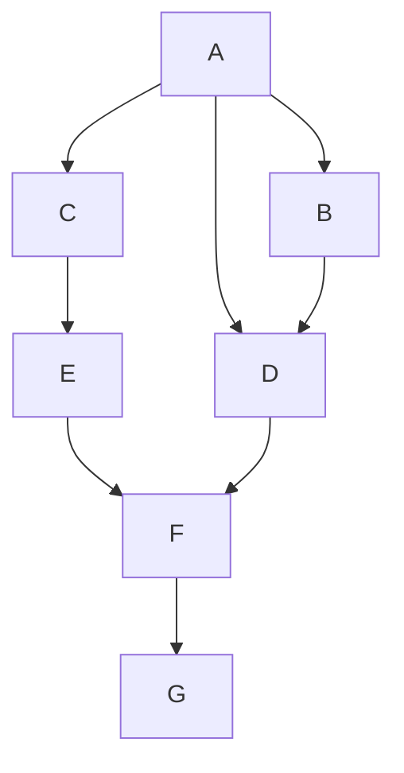
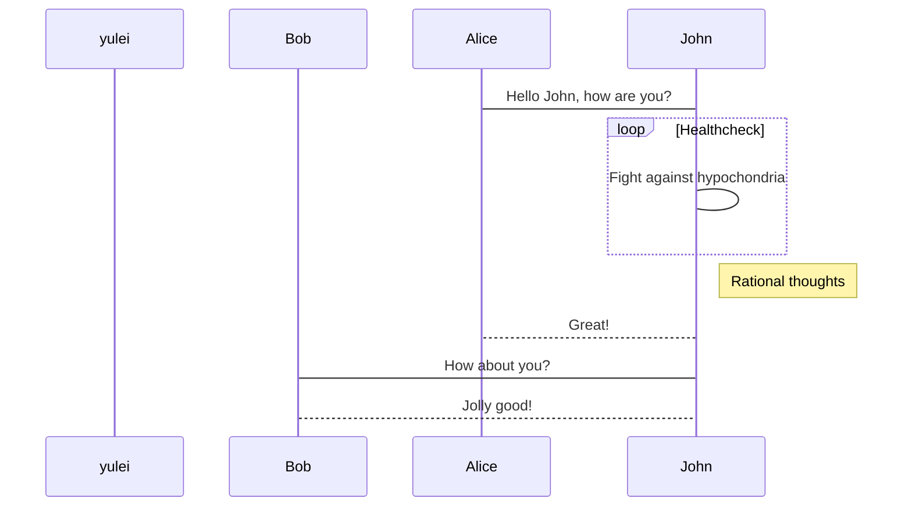
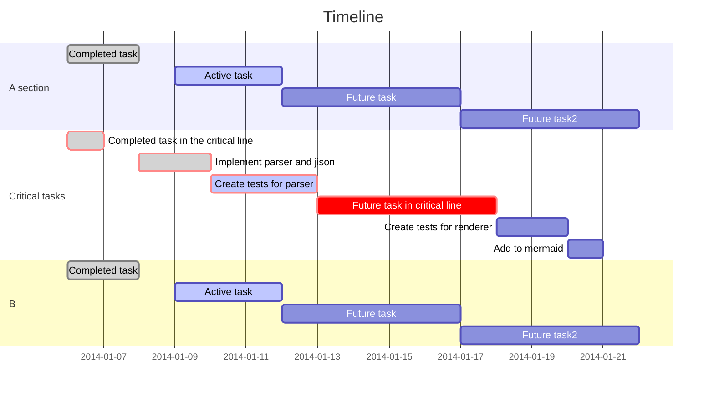

# 一级标题
## 二级标题
### 三级标题

### 分割线
上

---
下
### 图片和链接

### 表格
| First Header | Second Header | Third Header |
| ------------ | ------------- | ------------ |
| Content Cell | Content Cell  | Content Cell |
| Content Cell | Content Cell  | Content Cell |

| First Header | Second Header | Third Header |
| :----------- | :-----------: | -----------: |
| Left         |    Center     |        Right |
| Left         |    Center     |        Right |
### mermaid表格

### html格式

    <u>
    	hello
    </u>

<u>ok</u>