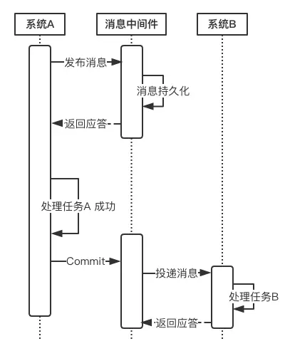
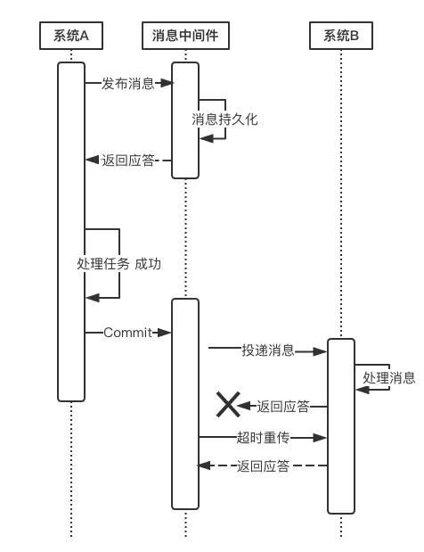

# 数据库MySQL知识点框架

- 数据库范式
- 数据库事务
  - 什么是事务？
  - 事务特性：ACID
  - 事务隔离级别以及脏读、不可重复读、幻读
  - 分布式事务
- 数据库索引
  - 索引的应用场景
  - 索引特点
  - 索引的优点和缺点
  - 索引的分类
  - 索引选择原则
  - 索引的优化
  - 索引失效
  - 索引的底层实现（B-Tree vs B+Tree）
  - 对于建立索引的列，数据均匀分布好还是不均匀好？
- 数据库的锁
  - 行锁 vs 表锁
  - 读锁 vs 写锁
  - 乐观锁 vs 悲观锁以及如何实现？（MVCC）
  - 加锁的方式
  - 分布式锁
- 数据库存储引擎比较
  - InnoDB
  - MyISAM
  - Memory
- MySQL连接池对比
- MySQL命令
- JOIN的执行计划
- 数据库分库分表
- 主从复制

# 数据库的三大范式

1. 数据库的每一列都是不可分割的原子数据项，而不能是数组、集合，记录等非原子数据项。
2. 强调记录的唯一性约束，表必须有一个主键，并且没有包含在主键中的列必须完全依赖于主键，而不能只依赖于主键的一部分。如果一个数据表的主键只有单一一个字段的话，它就一定符合第二范式
3. 第三范式：为了消除数据库中关键字之间的依赖关系。表中所有数据元素不但要能唯一地被主关键字标识而且它们之间还必须相互独立，不存在其他依赖关系。

# 数据库事务

一组SQL语句操作。

## 事务的特性

ACID

- 原子性：要么全部执行，要么全部失败回滚
- 一致性：执行事务前后的数据库状态一致。
- 隔离性：一个事务所做的修改在最终修改之前对其他事务是不可见的
- 持久性：一旦事务提交，则其所做的修改就会永久的保存到数据库中。

## 事务隔离级别

- 提交读（READ UNCOMMITTED）：事务的修改，即使没有提交，对其他事务也是可见的。事务可以读取未提交的数据，称为**脏读**。
- 不可重复读（READ COMMITTED）:一个事务所做的任何修改对其他事务是不可见的。因为执行同样的查询，可能得到不一样的结果
- 可重复读：同一个事务中多次读取同样记录的结果是一致的。
  - 幻读：当某个事务读取某个范围的记录时，另外一个事务又在该范围上插入了新的记录，当之前的事务再次读取该范围的记录时，就会产生幻行。
  - 幻读vs不可重复读：不可重复读重点在于修改，而幻读的重点在于新增或者删除
- 可串行化：所有事务串行执行

# 分布式事务

### 解决方案——基于可靠消息服务的分布式事务

这种实现分布式事务的方式需要通过消息中间件来实现。假设有A和B两个系统，分别可以处理任务A和任务B。此时系统A中存在一个业务流程，需要将任务A和任务B在同一个事务中处理。下面来介绍基于消息中间件来实现这种分布式事务。

- 在系统A处理任务A前，首先向消息中间件发送一条消息

- 消息中间件收到后将该条消息持久化，但并不投递。此时下游系统B仍然不知道该条消息的存在。

- 消息中间件持久化成功后，便向系统A返回一个确认应答；

- 系统A收到确认应答后，则可以开始处理任务A

- 任务A处理完成后，向消息中间件发送Commit请求。该请求发送完成后，对系统A而言，该事务的处理过程就结束了，此时它可以处理别的任务了。 但commit消息可能会在传输途中丢失，从而消息中间件并不会向系统B投递这条消息，从而系统就会出现不一致性。这个问题由消息中间件的**事务回查机制**完成。

  - 若系统A在处理任务A时失败，那么就会向消息中间件发送Rollback请求。和发送Commit请求一样，系统A发完之后便可以认为回滚已经完成，它便可以去做其他的事情。消息中间件收到回滚请求后，直接将该消息丢弃，而不投递给系统B，从而不会触发系统B的任务B。
  - 上面所介绍的Commit和Rollback都属于理想情况，但在实际系统中，Commit和Rollback指令都有可能在传输途中丢失。那么当出现这种情况的时候，消息中间件是如何保证数据一致性呢？——答案就是**超时询问机制。**
    - 系统A除了实现正常的业务流程外，还需提供一个事务询问的接口，供消息中间件调用。当消息中间件收到一条事务型消息后便开始计时，如果到了超时时间也没收到系统A发来的Commit或Rollback指令的话，就会主动调用系统A提供的事务询问接口询问该系统目前的状态。该接口会返回三种结果：
      - 提交 若获得的状态是“提交”，则将该消息投递给系统B。
      - 回滚 若获得的状态是“回滚”，则直接将条消息丢弃。
      - 处理中 若获得的状态是“处理中”，则继续等待。

- 消息中间件收到Commit指令后，便向系统B投递该消息，从而触发任务B的执行；

- 当任务B执行完成后，系统B向消息中间件返回一个确认应答，告诉消息中间件该消息已经成功消费，此时，这个分布式事务完成。

  

如果消息在投递过程中丢失，或消息的确认应答在返回途中丢失，那么消息中间件在等待确认应答超时之后就会重新投递，直到下游消费者返回消费成功响应为止。当然，一般消息中间件可以设置消息重试的次数和时间间隔，比如：当第一次投递失败后，每隔五分钟重试一次，一共重试3次。如果重试3次之后仍然投递失败，那么这条消息就需要人工干预。

#### 参考

[参考](https://juejin.im/post/5aa3c7736fb9a028bb189bca#heading-13)

# 一、数据库索引

> 本章内容可以结合算法中的查找进行学习整理

## 为什么索引能够提高查询速度？

- 各个数据页可以组成一个双向链表
- 每个数据页的记录可以组成一个单向链表
  - 每个数据页都会为存储在它里面的记录生成一个页目录，在通过主键查找某条记录时可以在页目录中使用二分法快速定位到对应的槽，然后再遍历该槽对应分组的记录即可快速查找到指定的记录
  - 以其他列（非主键）作为搜索条件时，只能从最小记录开始依次遍历单链表中的每条记录

所以说，如果我们写`select * from user where username='xx'`这样没有进行任何优化的sql语句，默认会这样做：

1. 定位到记录所在的页：需要遍历双向链表，找到所在的页
2. 从所在的页内查找对应的记录：由于不是根据主键查询，只能遍历所在页的单链表。

这样做的时间复杂度为O(N)，查找非常慢！

## 索引的应用场景

1. 快速查找符合where条件的记录
2. 对于使用MIN或MAX函数的查询
3. 对于ORDER BY 和GROUP BY，MySQL经常使用索引来高效完成分类和分组
4. 如果表中存在几个字段的联合索引，则查找记录时，这个索引的最左前缀匹配字段也会被自动作为索引来加速查找
5. 多表做JOIN操作时

## 索引的最左前缀原则

## 索引优点和缺点

优点
- 大大减少了服务器需要扫描的数据量

- 可以帮助服务器避免排序和临时表

- 可以将随机IO变为顺序IO

缺点

- 降低了大部分与写入相关的操作的速度

- 占用磁盘空间，多个索引会占用的更大的空间

## 索引的分类

索引是在存储引擎层实现的，而不是在服务器层实现的，所以不同存储引擎具有不同的索引类型和实现。

### 1.B+Tree索引

大多数MySQL存储引擎的默认索引类型

不需要进行全表扫描，只需要对树进行搜索即可，所以查找速度快很多

B+Tree的有序性，顺序组织存储，适合查找范围数据、排序和分组

可以指定多个列作为索引，多个索引列共同组成键

适用于全键值、键值范围和键前缀查找，其中键前缀查找只适用于最左前缀查找。如果不是按照索引列的顺序进行查找，则无法使用索引。可以只访问索引的查询

InnoDB 的 B+Tree 索引分为主索引和辅助索引。主索引的叶子节点 data 域记录着完整的数据记录，这种索引方式被称为聚簇索引。因为无法把数据行存放在两个不同的地方，所以一个表只能有一个聚簇索引。

辅助索引的叶子节点的 data 域记录着主键的值，因此在使用辅助索引进行查找时，需要先查找到主键值，然后再到主索引中进行查找。

> B+Tree 原理
>
> B Tree指的是Balance Tree，也就是平衡树。平衡树是一颗查找树，并且所有叶子节点在同一层。
>
> B+ Tree 是基于 B Tree 和叶子节点顺序访问指针进行实现，它具有 B Tree 的平衡性，并且通过顺序访问指针来提高区间查询的性能。
>
> 进行**查找操作**时，首先在根节点进行二分查找，找到一个 key 所在的指针，然后递归地在指针所指向的节点进行查找。直到查找到叶子节点，然后在叶子节点上进行二分查找，找出 key 所对应的 data。
>
> **插入删除操作**会破坏平衡树的平衡性，因此在插入删除操作之后，需要对树进行一个分裂、合并、旋转等操作来维护平衡性。

**与红黑树的比较：**

- 更少的查找次数：平衡树的查找操作时间复杂度和树高有关，O(h)=O(logdN)，其中d为每个结点的出度。而红黑树的出度为2，而B+Tree的出度一般都非常大，所有红黑树的高度很明显比B+Tree大非常多。

- 利用磁盘预读特性：为了减少磁盘 I/O 操作，磁盘往往不是严格按需读取，而是每次都会预读。预读过程中，磁盘进行顺序读取，顺序读取不需要进行磁盘寻道，并且只需要很短的磁盘旋转时间，速度会非常快。

  操作系统一般将内存和磁盘分割成固定大小的块，每一块称为一页，内存与磁盘以页为单位交换数据。数据库系统将索引的一个节点的大小设置为页的大小，使得一次 I/O 就能完全载入一个节点。并且可以利用预读特性，相邻的节点也能够被预先载入。

### 2.哈希索引

memory引擎显示支持哈希索引，且为默认索引。也可以创建自定义哈希索引（伪索引列，使用触发器来维护哈希索引）

非唯一的哈希索引（对于相同哈希值，会以链表的方式存放多个记录指针到同一个哈希表目中）

InnoDB 存储引擎有一个特殊的功能叫“自适应哈希索引”，当某个索引值被使用的非常频繁时，会在 B+Tree 索引之上再创建一个哈希索引，这样就让 B+Tree 索引具有哈希索引的一些优点，比如快速的哈希查找。

#### 哈希索引的限制

- 只包含哈希值和行指针，而不存储字段值，所以不能使用索引中的值来避免读取行。
- 无法排序
- 不支持部分索引匹配查找
- 只支持等值比较查询，不支持任何范围查询
- 哈希冲突越多，代价也就越大。（遍历链表所有的行指针，进行比较，直到找到所有符合条件的行）

### 3.空间数据索引

MyISAM 存储引擎支持空间数据索引（R-Tree），可以用于地理数据存储。空间数据索引会从所有维度来索引数据，可以有效地使用任意维度来进行组合查询。

必须使用 GIS 相关的函数来维护数据。

### 4.全文索引

MyISAM 存储引擎支持全文索引，用于查找文本中的关键词，而不是直接比较是否相等。

查找条件使用 MATCH AGAINST，而不是普通的 WHERE。

全文索引使用倒排索引实现，它记录着关键词到其所在文档的映射。

InnoDB 存储引擎在 MySQL 5.6.4 版本中也开始支持全文索引。

## 索引选择原则

## 索引的优化

### 使用Expain分析是否使用了优化

主要有以下几个参数：

select type：代表查询的类型

- simple：简单，查询中不包含子查询或者联合查询
- subquery：使用了子查询
- union：从union表获取结果的select

type：查询使用了哪种类型

分为system（只查询一条记录）、const（常数级别的查询）、range（只检索指定范围的行，开始于索引的某一点，结束于另一点，不用扫描全部表）、index（只需要遍历索引树）、all（遍历全表来读取）

key：使用的什么索引

row ：扫描的行数

### 优化数据的访问

#### 1.减少请求的数据量

- 只返回必要的列，不要使用*
- 只返回必要的行：limit
- 缓存重复查询的数据

#### 2.减少服务器的扫描次数——最有效的手段就是使用索引

### 

## 索引失效

## 索引的底层实现（B-Tree vs B+Tree）

## 对于建立索引的列，数据均匀分布好还是不均匀好？

# 二、数据库存储引擎比较

## InnoDB

MySQL默认的**事务型引擎**，只有在需要它不支持的特性时，才考虑使用其他引擎

实现四个标准的隔离级别，默认级别为可重复读。在可重复读隔离级别下，通过多版本控制+间隙锁（Next-Key Locking）来消除幻影读。

主索引是聚族索引，在索引中保存了数据，从而避免直接读磁盘，因此对查询性能有很大提升

内部做了很多优化，包括从磁盘读取数据时采用的可预测性预读、能够加快读操作并且自动创建的自适应哈希索引、能够加速插入操作的插入缓冲区

支持真正的在线热备份。其他引擎不支持在线热备份，要获取一致性视图需要停止对所有表的写入，而在读写混合场景中，停止写入可能也意味着停止读取。

## MyISAM

设计简单，数据以紧凑格式存储。对于只读数据，或者表比较小、可以容忍修复操作，则依然可以使用它。

提供了大量的特性，包括压缩表、空间数据索引

不支持事务

不支持行级锁，只能对整张表加锁，读取时会对需要读到数据的所有表加共享锁，写入时则对表加排他锁。但在表有读取操作的同时，也可以往表中插入新的记录，这被称作并发插入（CONCURRENT INSERT）

可以手动或者自动执行检查和修复操作，但是和事务恢复以及崩溃恢复不同，可能会导致一些数据丢失，而且修复操作非常慢。**最大的缺陷就是崩溃后无法安全恢复**

延迟更新索引键（Delayed Key Write）如果指定了 DELAY_KEY_WRITE 选项，在每次修改执行完成时，不会立即将修改的索引数据写入磁盘，而是会写到内存中的键缓冲区，只有在清理键缓冲区或者关闭表的时候才会将对应的索引块写入磁盘。这种方式可以极大的提升写入性能，但是在数据库或者主机崩溃时会造成索引损坏，需要执行修复操作。

**由于它是表级锁，对于表的读取为共享锁，所以相比于InnoDB，更适合读密集的情况**

## Memory

1. 数据保存在内存中，重启以后会丢失（结构保留但数据会丢失），不需要进行磁盘IO操作。

2. 支持哈希索引。

3. 是表级锁，并发写入的性能较低。

4. 应用场景
   - 用于查找或者映射表
   - 缓存周期性聚合数据的结果
   - 用于保存数据分析中产生的中间数据

## 比较

|   区别   |     InnoDB     |                      MyISAM                      |
| :------: | :------------: | :----------------------------------------------: |
|   事务   |      支持      |                      不支持                      |
|   并发   |     行级锁     |                      表级锁                      |
|   外键   |    支持外键    |                      不支持                      |
|   备份   | 支持在线热备份 |                      不支持                      |
| 崩溃恢复 |                | 崩溃后发生损坏的概率比InnoDB高很多，恢复速度更慢 |
| 其他特性 |                |             支持压缩表和空间数据索引             |

## Redis 和 Memcache

数据类型：Redis支持String、List、Set、Sorted Set、Hash，而memcache支持简单数据类型

持久性：Redis支持持久化操作，而memcache不支持

分布式存储：redis支持master-slave复制模式，memcache可以使用一致性hash做分布式

value大小不同：memcache是一个内存缓存，key的长度小于250字符

数据一致性不同：Redis支持单线程操作，保证数据按顺序提交。而memcache需要使用CAS保证数据的一致性。

# 三、数据库中的锁

- 行锁 vs 表锁
- 读锁 vs 写锁
- 乐观锁 vs 悲观锁以及如何实现？（MVCC）
- 加锁的方式
- 分布式锁

## 乐观锁和悲观锁以及如何实现？

## 乐观锁

每次去拿数据时都认为别人不会修改，所以不会上锁。只有在提交更新的时候会判断一下期间别人是否更新这个数据。即假设不会发生并发冲突，只有在提交操作时检查是否违反数据的完整性

## 悲观锁

每次去拿数据时都认为别人会修改，所有在每次取数据时都会上锁，假定会发生并发冲突，屏蔽一切可能违反完整性的操作。

## MVCC

MVCC是被MySQL中事务型存储引擎InnoDB所支持的。

MVCC在应对高并发事务，比单纯的加锁更高效

它只在READ COMMITED 和可重复读两个隔离级别下工作

MVCC可以使用乐观锁和悲观锁来实现

## 分布式锁

# 三、一致性哈希

[分布式缓存中的一致性哈希算法，这篇文章给讲透了！](https://juejin.im/post/5d0781c1f265da1b827a9ca2)

## Memcached 与客户端分布式缓存

Memcached 是一个高性能的分布式缓存系统，然而服务端没有分布式功能，各个服务器不会相互通信。

它的分布式实现依赖于客户端的程序库，这也是 Memcached 的一大特点。比如第三方的 spymemcached 客户端就基于一致性哈希算法实现了其分布式缓存的功能。

其具体步骤如下:

- 向 Memcached 添加数据，首先客户端的算法根据 key 值计算出该 key 对应的服务器。
- 服务器选定后，保存缓存数据。
- 获取数据时，对于相同的 key ，客户端的算法可以定位到相同的服务器，从而获取数据。

在这个过程中，客户端的算法首先要保证缓存的数据尽量均匀地分布在各个服务器上，其次是当个别服务器下线或者上线时，会出现数据迁移，应该尽量减少需要迁移的数据量。

其中，客户端算法是客户端分布式缓存性能优劣的关键。

普通的哈希表算法一般都是计算出哈希值后，通过取余操作将 key 值映射到不同的服务器上

但是当服务器数量发生变化时，取余操作的除数发生变化，所有 key 所映射的服务器几乎都会改变，这对分布式缓存系统来说是不可以接收的。

**一致性哈希算法能尽可能减少了服务器数量变化所导致的缓存迁移。**

## 哈希算法

**MD5 算法**：全称为 Message-Digest Algorithm 5，用于确保信息传输完整一致。是计算机广泛使用的杂凑算法之一，主流编程语言普遍已有 MD5 实现。

MD5 的作用是把大容量信息压缩成一种保密的格式（就是把一个任意长度的字节串变换成定长的16进制数字串）。常见的文件完整性校验就是使用 MD5。

**CRC 算法**：全称为 CyclicRedundancyCheck，中文名称为循环冗余校验。它是一类重要的，编码和解码方法简单，检错和纠错能力强的哈希算法，在通信领域广泛地用于实现差错控制。

**MurmurHash 算法**：高运算性能，低碰撞率，由 Austin Appleby 创建于 2008 年，现已应用到 Hadoop、libstdc++、nginx、libmemcached 等开源系统。

Java 界中 Redis，Memcached，Cassandra，HBase，Lucene和Guava 都在使用它。

**FNV 算法**：全称为 Fowler-Noll-Vo 算法，是以三位发明人 Glenn Fowler，Landon Curt Noll，Phong Vo 的名字来命名的，最早在 1991 年提出。 

FNV 能快速 hash 大量数据并保持较小的冲突率，它的高度分散使它适用于 hash 一些非常相近的字符串，比如 URL，hostname，文件名，text 和 IP 地址等。

**Ketama 算法**：一致性哈希算法的实现之一，其他的哈希算法有通用的一致性哈希算法实现，只不过是替换了哈希映射函数而已，但 Ketama 是一整套的流程，我们将在后面介绍。

## 一致性哈希算法

首先将缓存服务器（ ip + 端口号）进行哈希，映射成环上的一个节点，计算出缓存数据 key 值的 hash key，同样映射到环上，并顺时针选取最近的一个服务器节点作为该缓存应该存储的服务器。具体实现见后续的章节。

当服务器 B 宕机下线，服务器 B 中存储的缓存数据要进行迁移，但由于一致性哈希环的存在，只需要迁移key 值为1的数据，其他的数据的存储服务器不会发生变化。这也是一致性哈希算法比取余映射算法出色的地方。

现实情况下，服务器在一致性哈希环上的**位置不可能分布的这么均匀**，导致了每个节点实际占据环上的区间大小不一。这种情况下，可以**增加虚节点**来解决。通过增加虚节点，使得每个节点在环上所“管辖”的区域更加均匀。这样就既保证了在节点变化时，尽可能小的影响数据分布的变化，而同时又保证了数据分布的均匀。

> 虚拟节点是实际节点在hash空间的复制品，一个实际节点对应多个“虚拟节点”。虚拟节点的计算可以通过对应节点的IP地址加数字后缀的方式，例如A节点的IP地址为202.168.14.242，引入“虚拟节“点后，
>
> hash("202.168.14.242#1")
>
> hash("202.168.14.242#2")
>
> hash("202.168.14.242#3")