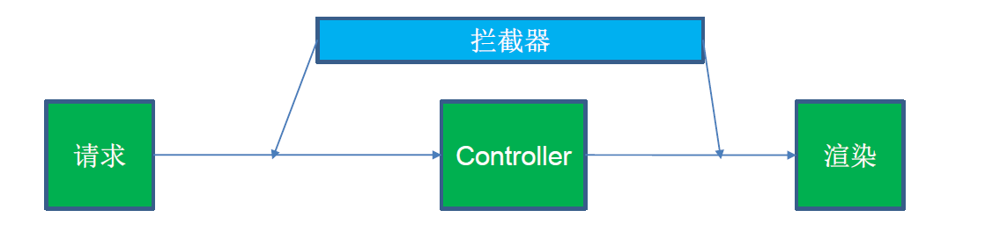

# 注册

## 注册流程

1. 用户名合法检测

长度、敏感词、重复、特殊字符

2. 密码salt加密

密码强度检测MD5，创建util文件夹下的MD5类

```java
public class WendaUtil {
    private static final Logger logger = LoggerFactory.getLogger(WendaUtil.class);
    public static String MD5(String key) {
        char hexDigits[] = {
                '0', '1', '2', '3', '4', '5', '6', '7', '8', '9', 'A', 'B', 'C', 'D', 'E', 'F'
        };
        try {
            byte[] btInput = key.getBytes();
            // 获得MD5摘要算法的 MessageDigest 对象
            MessageDigest mdInst = MessageDigest.getInstance("MD5");
            // 使用指定的字节更新摘要
            mdInst.update(btInput);
            // 获得密文
            byte[] md = mdInst.digest();
            // 把密文转换成十六进制的字符串形式
            int j = md.length;
            char str[] = new char[j * 2];
            int k = 0;
            for (int i = 0; i < j; i++) {
                byte byte0 = md[i];
                str[k++] = hexDigits[byte0 >>> 4 & 0xf];
                str[k++] = hexDigits[byte0 & 0xf];
            }
            return new String(str);
        } catch (Exception e) {
            logger.error("生成MD5失败", e);
            return null;
        }
    }
}
```

## 注册类代码实现

- 返回值Map，用于存储注册失败的原因信息。

- 合法检测->设置用户信息(username,salt,headUrl,Password)->添加用户->添加ticket(token,cookie)->返回Map信息
- 如何设置salt：*UUID.randomUUID().toString().substring(0,5)*

```java
public Map<String,String> register(String username,String password){
    Map<String,String>map=new HashMap<>();
    //合法检测
    if(StringUtils.isEmpty(username)){
        map.put("msg","用户名不能为空");
        return map;
    }
    if(StringUtils.isEmpty(password)){
        map.put("msg","密码不能为空");
        return map;
    }
    User user=userDAO.selectByName(username);
    if(user!=null){
        map.put("msg","用户名已经被注册");
        return map;
    }
    user =new User();
    user.setName(username);
    //添加salt
    user.setSalt(UUID.randomUUID().toString().substring(0,5));
    user.setHeadUrl(String.format("http://images.nowcoder.com/head/%dt.png",new Random().nextInt(1000)));
    //结合salt创建密码
    user.setPassword(WendaUtil.MD5(password+user.getSalt()));
    userDAO.addUser(user);
    
     //登陆
     String ticket=addLoginTicket(user.getId());
     map.put("ticket",ticket);
     return map; 
}
```

## *Controller*实现

- 由于需要提交password、username信息，所以http请求为**post**
- 请求参数：password username next用于页面跳转（可以为空）以及请求响应

> 使用`/reglogin`页面来提交用户名密码表单，也就是说先通过访问/reglogin网页输入用户名密码，然后再进行注册登录操作跳转。

```java
    @Autowired
    UserService userService;

    @RequestMapping(path = {"/reg/"}, method = {RequestMethod.POST})
    public String reg(Model model,
                        @RequestParam("password") String password,
                        @RequestParam("username") String username,
                      @RequestParam(value="next",required = false)String next,
                      HttpServletResponse response) {
        try {
            Map<String, String> map = userService.register(username, password);
            if (map.containsKey("ticket")) {
                Cookie cookie=new Cookie("ticket",map.get("ticket"));
                cookie.setPath("/");
                response.addCookie(cookie);
                if(!StringUtils.isEmpty(next)){
                    return "redirect:"+next;
                }
                return "redirect:/";
            }else {
                model.addAttribute("msg", map.get("msg"));
                return "login";
            }
        } catch (Exception e) {
            logger.error("注册异常" + e.getMessage());
            return "login";
        }
    }

	@RequestMapping(path = {"/reglogin"}, method = {RequestMethod.GET})
    public String login(Model model,
                        @RequestParam(value = "next",required = false)String next) {
        model.addAttribute("next",next);
        return "login";
    }
```

## *html*前端代码

> 注意登陆和注册按钮的写法以及form表格的提交

```html
<!DOCTYPE html>
<html lang="zh-CN" xmlns:th="http://www.thymeleaf.org"
      class="is-AppPromotionBarVisible cssanimations csstransforms csstransitions flexbox no-touchevents no-mobile">
<head>
    <meta http-equiv="Content-Type" content="text/html; charset=UTF-8">
    <meta http-equiv="X-UA-Compatible" content="IE=edge,chrome=1">
    <meta name="renderer" content="webkit">
    <meta name="description" content="一个真实的网络问答社区，帮助你寻找答案，分享知识。">
    <meta name="viewport" content="user-scalable=no, width=device-width, initial-scale=1.0, maximum-scale=1.0">
    <title>牛客 - 与世界分享你的知识、经验和见解</title>
    <link rel="dns-prefetch" href="">
    <link rel="stylesheet" href="/styles/login.css">

</head>
<body class="zhi  no-auth">
<div class="index-main">
    <div class="index-main-body">
        <div class="index-header">
            <h1 class="logo hide-text"></h1>
            <h2 class="subtitle">
                <span th:if="${msg}!=null"><p th:text="${msg}"></p></span>
                <span th:if="${msg}==null">与世界分享你的知识、经验和见解</span>
            </h2>
        </div>
        <div class="desk-front sign-flow clearfix sign-flow-simple">
            <div class="view view-signin" data-za-module="SignInForm" style="display: block;">
                <form action="/reg/" id="regloginform" method="post">
                    <input type="hidden" name="_xsrf" value="21aa1c8d254df2899b23ab9afbd62a53">
                    <div class="group-inputs">
                        <div class="email input-wrapper">
                            <input type="text" name="username" aria-label="手机号或邮箱" placeholder="手机号或邮箱" required="">
                        </div>
                        <div class="input-wrapper">
                            <input type="password" name="password" aria-label="密码" placeholder="密码" required="">
                        </div>
                    </div>
                    <input type="hidden" name="next" th:value="${next}"/>
                    <div class="button-wrapper command clearfix">
                        <button class="sign-button submit" type="submit" onclick="form=document.getElementById('regloginform');form.action='/login/'">登录</button>
                        <button class="sign-button submit" type="submit" onclick="form=document.getElementById('regloginform');form.action='/reg/'">注册</button>
                    </div>
                    <div class="signin-misc-wrapper clearfix">
                        <label class="remember-me">
                            <input type="checkbox" name="rememberme" checked="" value="true"> 记住我
                        </label>
                        <a class="unable-login" href="#">无法登录?</a>
                    </div>
                </form>
            </div>
        </div>
    </div>
</div>
</body>
</html>
```

# 登陆

## 登陆流程

1. 密码校验以及**token**登记

   - 服务端创建**token**来关联userId，后续的网页操作根据**token**来识别用户
   - 客户端存储token（app存储本地，浏览器存储到cookie）
2. 服务端/客户端token有效期设置

> 注：token可以是sessionId也可以是cookie里的一个key，本项目中使用cookie的key也就是ticket来识别用户    

## 登陆类实现

```java
public Map<String,String> login(String username,String password){
    Map<String,String>map=new HashMap<>();
    if(StringUtils.isEmpty(username)){
        map.put("msg","用户名不能为空");
        return map;
    }
    if(StringUtils.isEmpty(password)){
        map.put("msg","密码不能为空");
        return map;
    }
    User user=userDAO.selectByName(username);
    if(user==null){
        map.put("msg","用户名不存在");
        return map;
    }
    if(!WendaUtil.MD5(password+user.getSalt()).equals(user.getPassword())){
        map.put("msg","密码错误");
        return map;
    }
    String ticket=addLoginTicket(user.getId());
    map.put("ticket",ticket);
    return map;
}
```

## 创建ticket 

1. 在创建用户ticket前，需要先创建login_ticket数据表。有id,user_id,ticket,expired,status

~~~sql
DROP TABLE IF EXISTS `login_ticket`;
  CREATE TABLE `login_ticket` (
    `id` INT NOT NULL AUTO_INCREMENT,
    `user_id` INT NOT NULL,
    `ticket` VARCHAR(45) NOT NULL,
    `expired` DATETIME NOT NULL,
    `status` INT NULL DEFAULT 0,
    PRIMARY KEY (`id`),
    UNIQUE INDEX `ticket_UNIQUE` (`ticket` ASC)
    ) ENGINE=InnoDB DEFAULT CHARSET=utf8;
~~~

2. 创建LoginTicketDAO,实现插入、根据ticket获取ticket、更新status字段

```java
@Repository
@Mapper
public interface LoginTicketDAO {
    String TABLE_NAME=" login_ticket ";
    String INSERT_FILEDS=" user_id,expired,status,ticket ";
    String SELECT_FILEDS=" id, "+INSERT_FILEDS;

    @Insert({"insert",TABLE_NAME,"(",INSERT_FILEDS,
            ") values (#{userId},#{expired},#{status},#{ticket})"})
    int addTicket(LoginTicket ticket);

    @Select({"select ",SELECT_FILEDS,"from",TABLE_NAME,"where ticket=#{ticket}"})
    LoginTicket selectByTicket(String ticket);

    @Update({"update ",TABLE_NAME," set status=#{status} where ticket=#{ticket}"})
    void updateStatus(@Param("ticket")String ticket,@Param("status")int status);
}
```
3. 给用户分配ticket，值得注意的是，ticket和salt都是由UUID产生的。
```java
public String addLoginTicket(int userId){
    LoginTicket loginTicket=new LoginTicket();
    loginTicket.setUserId(userId);
    Date now =new Date();
    now.setTime(3600*24*100+now.getTime());
    loginTicket.setExpired(now);
    loginTicket.setStatus(0);
    loginTicket.setTicket(UUID.randomUUID().toString().replaceAll("-",""));
    LoginTicketDAO.addTicket(loginTicket);
    return loginTicket.getTicket();
}
```

   ## *Controller*实现

```java
@RequestMapping(path = {"/login/"}, method = {RequestMethod.POST})
public String login(Model model,
                    @RequestParam("password") String password,
                    @RequestParam("username") String username,
                    @RequestParam(value = "rememberme",defaultValue = "false")boolean rememberme,
                    @RequestParam(value = "next",required = false)String next,
                    HttpServletResponse response) {
    try {
        Map<String, String> map = userService.login(username, password);
        if (map.containsKey("ticket")) {
            Cookie cookie=new Cookie("ticket",map.get("ticket"));
            cookie.setPath("/");
            response.addCookie(cookie);
            if(!StringUtils.isEmpty(next)){
                return "redirect:"+next;
            }
            return "redirect:/";
        }else{
            model.addAttribute("msg", map.get("msg"));
            return "login";
        }
    } catch (Exception e) {
        logger.error("注册异常" + e.getMessage());
        return "login";
    }
}
```

# *Interceptor*拦截器

## 页面访问流程

1. 客户发送带token（ticket）的HTTP请求
2. 服务段
   - 根据token获取用户id
   - 根据id获取用户的具体信息（expired、status等）
   - 用户和页面访问权限处理
   - 渲染页面/跳转页面

## *Interceptor*链路回调



- 注解`@Componet`，并实现```HandlerInterceptor```
- 重写`preHandle`， `postHandle`、`afterCompletion`三个方法


在preHandle中根据cookie中的ticket来获取用户id。根据id获取用户的信息，判断非空、期限、状态进行有效性判断。然后将user保存到hosHolder中，在后续所有需要渲染的页面使用。

在postHanle中将hostHolder中的user注入到html中

最后在afterCompletion中清除hostHolder的user

### PassportInterceptor

1. model/hostHolder类实现

```java
@Component
public class HostHolder {
    //本地线程，对于不同用户登陆界面对应不同的users
    private static ThreadLocal<User> users=new ThreadLocal<>();

    public User getUser(){
        return users.get();
    }

    public void setUser(User user){
        users.set(user);
    }

    public void clear(){
        users.remove();
    }
}
```

2. PassportInterceptor实现

```java
@Component
public class PassportInterceptor implements HandlerInterceptor {
    @Autowired
    LoginTicketDAO loginTicketDAO;
    @Autowired
    UserDAO userDAO;
    @Autowired
    HostHolder hostHolder;
    @Override
    public boolean preHandle(HttpServletRequest request, HttpServletResponse response, Object handler) throws Exception {
        String ticket=null;
        if(request.getCookies()!=null){
            for(Cookie cookie:request.getCookies()){
                if(cookie.getName().equals("ticket")){
                    ticket=cookie.getValue();
                    break;
                }
            }
        }
        if(ticket!=null){
            LoginTicket loginTicket=loginTicketDAO.selectByTicket(ticket);
            //有效性判断
            if(loginTicket==null || loginTicket.getExpired().before(new Date())|| loginTicket.getStatus()!=0){
                return true;
            }
            User user=userDAO.selectById(loginTicket.getUserId());
            hostHolder.setUser(user);
        }
        return true;
    }

    @Override
    public void postHandle(HttpServletRequest request, HttpServletResponse response, Object handler, ModelAndView modelAndView) throws Exception {
        if(modelAndView!=null){
            modelAndView.addObject("user",hostHolder.getUser());
        }
    }

    @Override
    public void afterCompletion(HttpServletRequest request, HttpServletResponse response, Object handler, Exception ex) throws Exception {
        hostHolder.clear();
    }
}
```

3. 添加Interceptor到工程配置中

创建configuration文件夹下创建AnswerWebConfiguration类实现WebMvcConfigurer并重写方法addInterceptors。

```java
@Component
public class AnswerWebConfiguration implements WebMvcConfigurer {
    @Autowired
    PassportInterceptor passportInterceptor;
    @Autowired
    LoginRequiredInterceptor loginRequiredInterceptor;
    @Override
    public void addInterceptors(InterceptorRegistry registry) {
        registry.addInterceptor(passportInterceptor);
        registry.addInterceptor(loginRequiredInterceptor).addPathPatterns("/user/*");
    }
}
```

### LoginRequiredInterceptor

限制部分页面需要登陆后才能正常访问，强制跳转到登陆界面。保留要跳转的界面，当登陆成功后自动跳转到之前要访问的页面。

1. LoginRequiredInterceptor类实现

```java
@Component
public class LoginRequiredInterceptor implements HandlerInterceptor {
    @Autowired
    HostHolder hostHolder;
    @Override
    public boolean preHandle(HttpServletRequest request, HttpServletResponse response, Object handler) throws Exception {
        if(hostHolder.getUser()==null){
            response.sendRedirect("/reglogin?next="+request.getRequestURI());
        }
       return true;
    }

    @Override
    public void postHandle(HttpServletRequest request, HttpServletResponse response, Object handler, ModelAndView modelAndView) throws Exception {
        if(modelAndView!=null){
            modelAndView.addObject("user",hostHolder.getUser());
        }
    }

    @Override
    public void afterCompletion(HttpServletRequest request, HttpServletResponse response, Object handler, Exception ex) throws Exception {
        hostHolder.clear();
    }
}
```

2. 添加Interceptor到工程配置中

> 使用addPathPatterns（"/user/*"）来限制Interceptor要作用的页面，也就是说只要要跳转到`/user/`下的所有页面时，才会使用该拦截器

~~~java
@Component
public class AnswerWebConfiguration implements WebMvcConfigurer {
    @Autowired
    PassportInterceptor passportInterceptor;
    @Autowired
    LoginRequiredInterceptor loginRequiredInterceptor;
    @Override
    public void addInterceptors(InterceptorRegistry registry) {
        registry.addInterceptor(passportInterceptor);
        registry.addInterceptor(loginRequiredInterceptor).addPathPatterns("/user/*");
    }
}
~~~

# 登出

## 登出类实现

更新ticket的status为1

```java
public void logout(String ticket){
    LoginTicketDAO.updateStatus(ticket ,1);
}
```

## Controller实现

```java
@RequestMapping(path = {"/logout"}, method = {RequestMethod.GET})
public String logout(@CookieValue("ticket")String ticket) {
    userService.logout(ticket);
    return "redirect:/";
}
```


# 问题

## 静态资源无法正常显示问题

静态资源映射在*SpringBoot*中，默认配置的/** 映射到/static。所以在后续的资源引入直接从static下资源引用即可。

~~~html
<!--- 错误引用资源 --->
<link rel="stylesheet" href="../styles/login.css">
<!--- 正确引用资源 --->
<link rel="stylesheet" href="/styles/login.css">
~~~

参考：[IntelliJ IDEA+SpringBoot中静态资源访问路径陷阱：静态资源访问404](<https://blog.csdn.net/zhoucheng05_13/article/details/78197766>)

