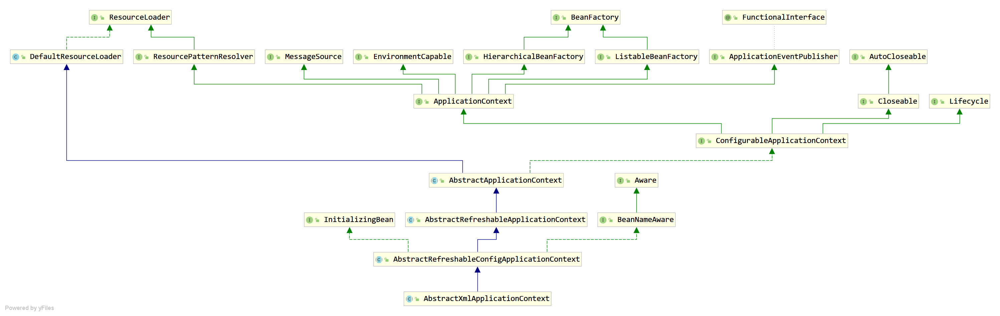

随着需求的变化，代码改动过大的原因是什么？

学习新的**设计模式**来重构我们的代码。前人根据自己的经验总结出来的，代表了代码设计的最佳实践。

从优秀的开源框架中，学习如何去使用。


**观察者模式**

合理利用Spring事件机制来完成自己的需求。订单通知情景

**模板方法模式**

例如数据库的操作时，有很多重复的步骤，只修改特定的步骤来实现。

**策略模式**

电商"杀熟"怎么实现？对于不同买家实现不同的价格

总共有23种设计模式

## 理解ApplicationContext



通过FileSystemXmlApplicationContext来理解ApplicationContext

# 注解的使用方法

## 如何给注册一个类？

xml配置文件

注解的方法

## 自动扫描组件和扫描规则

*ANNOTATION*

定制过滤规则

## 设置组件作用域

默认获取都是单实例

PROTOTYPE：多实例，IOC启动不会创建对象，只有在获取时才会创建对象到IOC容器中

SINGLETON：单实例（默认），IOC容器启用会调用方法创建对象到IOC容器中。

懒加载`@Lazy`：容器启动时，不会创建对象。只有在第一次使用获取，并初始化。

## 按照一定的条件给容器中注册Bean

Conditional

## 导入组件到IoC容器

- import
  - @import(xxx.class,...)
  - **ImportSelector**
  - ImportBeanDefinitionRegistry

- 默认类：@Component @Controller @Service

- 自定义类：@Bean

- 使用Spring提供的FactoryBean（工厂Bean）

  默认获取getObject返回的对象。如果加上&将获得FactoryBean本身

## 生命周期

bean创建-创建-销毁的过程，使用容器来管理bean生命周期。可以自定义初始化和销毁方法

指定初始化和销毁方法

**1. @Bean**

使用`@Bean(initMethod="",destroyMethod="")`

初始化：对象创建完成，并赋值好。调用初始方法

销毁：单实例：容器关闭的时候销毁。而对于多实例，容器 销毁bean。

**2. 让Bean实现IntializingBean和DisposableBean**

重写对应的方法

**3. 使用@PostContruct和@PreDestroy**

JSR250，使用这两个注解来修饰对应的初始化方法和销毁方法

**4. BeanPostProcessor——bean的后置处理器**

初始化前后调用

## 赋值

使用@Value赋值

1. 基本数值
2. 可以写SpEL，#{}
3. ${}配置文件中的值（在运行环境变量里面的值）

## 自动装配

Spring利用依赖注入（DI），完成对IoC容器中各个组件依赖关系赋值。后置处理器的实际应用

**1. Autowired**

spring带有的Autowired。可以标注属性、方法、构造器、参数

- 默认优先按照类型去容器中找对应的组件：applicationContext.getBean(XXX.class)

- 如果容器中有多个相同类型的组件，再将字段名作为组件的id去容器中查找
- 使用@Qualifier("xxxx")，指定需要装配的组件的id

- 自动装配默认一定要将属性赋值好，没有就会报错。可以使用@Autowired(required=false)可以作为非必须
- @Primary让Spring自动装配默认使用首选的Bean。也可以继续使用@Qualifier。

当标注方法时，Spring容器会创建当前对象，就会调用方法，完成赋值。其中方法使用的参数，自定义类型的值从IoC容器中获取。@Bean标注的方法创建对象的时候，方法的参数的值从容器中获取

当标注构造器时，默认加在IoC容器中的组件，容器启动会调用无惨构造器创建对象，再进行初始化赋值等操作。如果组件只有一个有参构造器，@Autowired可以省略。

组件如果想要使用Spring容器底层的一些组件（ApplicationContext、BeanFactory等），自定义组件可以实现XXXAware：在创建对象的时候，会调用接口规定的方法注入到相关组件。原理也能使用XXXprocessor处理的

**2.Resource和Inject**

支持使用java规范的注解@Resource和@Inject。

**@Resource**：以和Autowired实现自动装配，但是这个注解默认是按照组件名称来装配。可以使用@Resource(name="xxxx")来指定，但不能支持@Primary和@Autowired(required=false)。

**@Inject**：需要导入javax.inject，和Autowired支持@Primary，但不支持required。

## Profile

可以根据当前环境**动态的激活和切换**一系列组件的功能。

例如开发环境、测试环境、生产环境

- 使用命令行参数：在虚拟机参数位置加载 -Dspring.profiles.active=test
- 使用代码

~~~java
1.创建一个applicationContext
AnnotationConfigApplicationContext applicationContext=new AnnotationConfigApplicationContext();
2.设置需要激活的环境
applicationContext.getEnvironment().setActiveProfiles("test","dev");
3.注册主配置类
applicationContext.register(MainConfigProfile.class);
4.启动刷新容器
applicationContext.refresh();
~~~

- 写在配置类上，没有指定环境表示的Bean都会被加载

# AOP

## 如何使用AOP

动态代理：指在程序运行期间将一段代码切入到指定方法指定位置运行的编程方式

**aop准备工作**

- 导入aop模块：Spring AOP（spring-aspects）

- 创建一个业务逻辑类（MathCalculator），在业务逻辑运行的时候将日志进行打印（方法之前、结束或者出异常等情况）

- 切面需要能感知到方法运行到哪里了。

> 通知方法有
>
> 前置通知(@Before)：目标方法运行之前运行
>
> 后置通知(@After)：方法运行之后通知
>
> 返回通知(@AfterReturning)：返回通知
>
> 异常通知(@AfterThrowing)：方法出现异常后运行
>
> 环绕通知(@Around)：动态代理，手动推进目标方法运行（joinPoint.procced()）

**创建和使用切面类：**

1. 给切面类的目标方法标注
2. 将切面类和业务逻辑类都加入到容器中
3. 告诉容器哪个类是切面类，也就是给切面类上加上@Aspect标注
4. 给配置类中加上@EnableAspectJAtutoProxy（开启基于注解的aop模式）

## AOP原理

看给容器中注册了什么组件,这个组件什么时候工作,以及组件的作用是什么?

### 核心注解@EnableAspectJAutoProxy

```
@Import({AspectJAutoProxyRegistrar.class})
```

给容器中导入AspectJAutoProxyRegistrar。利用AspectJAutoProxyRegistrar自定义容器中注册Bean

AnnotationAwareAspectJAutoProxyCreator=internalAutoProxyCreator

给容器中注册一个AnnotationAwareAspectJAutoProxyCreator

### AnnotationAwareAspectJAutoProxyCreator


注意其中**SmartInstantiationAwareBeanPostProcessor**后置处理器和**BeanFactorAware**

在和处理器以及BeanFactory相关的方法处打上断点，进行调试。

```java
AbstractAutoProxyCreator
public void setBeanFactory(BeanFactory beanFactory)
public Object postProcessBeforeInstantiation(Class<?> beanClass, String beanName)
public Object postProcessAfterInitialization(@Nullable Object bean, String beanName)

AbstractAdvisorAutoProxyCreator
public void setBeanFactory(BeanFactory beanFactory)->initBeanFactory()

AspectJAwareAdvisorAutoProxyCreator

AnnotationAwareAspectJAutoProxyCreator
protected void initBeanFactory(ConfigurableListableBeanFactory beanFactory)
```

### 流程

创建IOC容器，传入配置类

注册配置类，调用refresh()刷新容器。

registerBeanPostProcessors(beanFactory);

1. 先获取IoC容器已经定义了的需要创建对象的所有BeanPostProcessor

2. 给容器中加其他的BeanPostProcessor

3. 优先注册实现了PriorityOrdered接口的BeanPostProcessor

4. 再给容器中注册实现了Ordered接口的BeanPostProcessor

5. 注册没有实现优先级接口的BeanPostProcessor

6. 注册BeanPostProcessor，实际上就是创建BeanPostProcessor对象，保存到容器中。

   1. 创建Bean的实例
   2. populateBean：给Bean的各种属性赋值
   3. initializeBean：初始化bean
      1. invokeAwareMethods（），处理Aware接口的方法回调
      2. applyBeanPostProcessorsBeforeInitialization（）：应用后置处理器的postProcessorBeforeInitialization（）
      3. invokeInitMethods（）：执行自定义的初始化方法
      4. applyBeanPostProcessorsAfterInitialization（）：执行后置处理器的postProcessorAfterInitialization（）
   4. BeanPostProcessor(AnnotationAwareAspectJAutoProxyCreator)创建成功

7. 把BeanPostProcessor注册到BeanFactory中

   beanFactory.addBeanPostProcessor(postProcessor)


AnnotationAwareAspectJAutoProxyCreator=>InstantiationAwareBeanPostProcessor

1. 遍历获取容器中所有的Bean，依次创建对象getBean（beanName）

   getBean（）-> doGetBean ->getSingleton()

2. 创建Bean