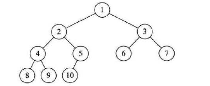
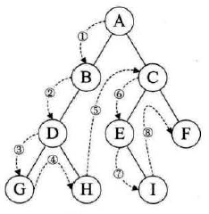
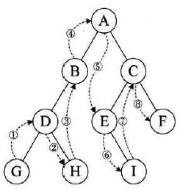
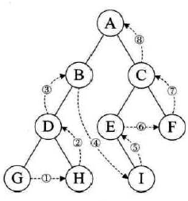
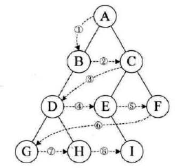

# 一、数组

## 数组的基本概念

数组（Array）：一种线性表的数据结构。用一组连续的内存空间来存储一组具有相同数据类型的数据

- 线性表与非线性表
  - 线性表（Linear List）：数据排成像一条线一样的结构。每个线性表上的数据最多只有前后两个方向的数据。例如：数组、链表、队列、栈
  - 非线性表：数据之间不是简单的前后关系，例如：二叉树、堆、图
- 连续的内存空间和相同类型的数据
  - 这个两个限制使得数组有一个杀手级的特性：随机访问。即根据下标随机访问的时间复杂度为O（1）。但是要注意数组中查找一个元素的时间复杂度不是O(1)。
  - 因为需要连续的内存空间，因此对于插入和删除操作非常低效。

## 数据基本操作

- 插入

  - 实现：将某个元素插入到数据第k个位置，需要将k~n部分的元素向后搬移一位，然后插入元素。若插入到数组的末尾，时间复杂度为O(1)；插入到数组的开头，时间复杂度为O(n)；插入的平均时间复杂度为（1+2+3+...+n）/n=O(n)。注意这个实现针对的数组是有序的。
  - **优化**：若数组只是一个存储数据的集合，其元素是无序的，则插入时不需要搬移数据。插入到数据第k个位置的思路为：将该位置的元素移动到数组末尾，然后将待插入元素插入到第k个位置，时间复杂度为O(1)。注意：这个优化是针对数据是无序的，这个优化其实是放弃了数组逻辑上的连续

- 删除

  - 实现：删除第k个位置，则需要将k+1~n个元素向前搬移一位。若要删除末尾，时间复杂度为O(1)；

    删除开头，时间复杂度O(n)；删除平均复杂度为O(n)

  - 优化：将多次删除一起执行。当我们需要删除多个元素时，并不立即执行搬移操作，而是将多个元素标记为已删除，然后当数组满了的时候，将标记的元素一起删除，这样就减少了搬移次数，提高了效率。这就是**JVM中的标记-删除算法核心思想**

- 随机访问

  - 实现：数组的随机访问，只需要根据首地址和下标通过寻址公式计算出对应内存地址即可

## 数据的内存模型

- 访问数组的本质：计算机为每一个数组分配了一段连续的内存，计算机通过访问内存的地址访问内存，因此访问数组的本质就是访问一段连续内存。对内存的要求较高
- 既然访问数组其实是访问一段内存，那么计算机就可以根据数组的首地址和下标，通过计算公式计算出每个元素所在的位置，数组访问寻址公式：
  - 给定一维数组a[n],则a[k]的内存地址为：`a[k]_address = base_address + k * type_size`
  - 给定二维数组`a[m][n]`则`a[i][j]`的内存地址为：`a[i][j]_address = base_address + (i*n + j) * type_size `。

# 二、链表

链表（Linked List）：一种线性表数据结构。它用一组不连续的内存空间来存储一组具有相同数据类型的数据。

## 链表的基本操作

- 插入：链表的插入操作只需要调整前后节点的指针即可，时间复杂度为O(1)
- 删除：链表的删除只需要调整前后节点的指针即可，O(1)
- 随机访问：链表的随机访问，无法像数组一样通过寻址公式计算出下标的内存位置，只能通过遍历找到相应的节点，O(n)

## 链表的分类

### 1. 单链表

结构：head -> data -> data -> null

特点：结构简单，但是随机访问某个节点时，只能从头到尾，找到这个节点

### 2. 循环链表

结构：head -> data -> data -> head

特点：与单链表相比，其优势在于可以从尾到头遍历。

### 3. 双向链表

结构：head <-> data <-> data -> null

特点：最大的优势在于找到前驱节点的时间复杂度为O(1)，正因为这个特点，使得双向链表在某些情况下，插入、删除等操作比单链表简单高效，尽管时间复杂度都是O(1)。虽然占用的内存要高于单链表，但是日常使用，双向链表更加常用。**Java中LinkedHashMap就用双向链表来记录插入的插入的键值对的顺序**

### 4. 双向循环链表

双向循环链表是双向链表与循环链表的组合

### 问题：为什么双向链表比单链表高效?

#### 插入和删除

（1）删除操作

在实际开发中，从链表删除一个数据主要有以下两种情况：

- 删除某个值等于给定值的节点
- 删除给定指针指向的节点

事实上，删除操作本身的时间复杂度为O(1),单链表和双向链表的性能差别，主要在于查找的过程。

对于第一种情况，无论单链表还是双向链表，无论是插入还是删除，都需要从头到尾遍历找到“值等于给定值”的节点，因此二者的时间复杂度均为O(n)。

对于第二种情况，已经找到了要删除的节点（记为q），但是要删除这个节点需要知道其前驱节点(记为p)。单链表中，无法立即知道q的前驱节点p,因此只能从头遍历，直到`p->next = q`，这个过程的时间复杂度是O(n); 而双向链表要删除的节点q已经保存了前驱节点p的指针。因此可以O(1)的时间找到p。因此单链表删除操作时间复杂度为O(n)，而双向链表为O(1)。

（2）插入操作

分析同上

#### 查找

对于有序链表，双向链表按值查找的效率要高于单链表。因为我们可以记录上一次查找的位置p，每次查找时，比较要查找的值与p的关系，若小于p，则向前查找，反之则向后，平均只需要查找一半的数据

因此双向链表在删除和插入给定节点以及在有序链表中查找值这几种情况下，效率要高于单链表。

事实上，这里的双向链表的性能来自于其对空间的牺牲，它的空间占用要高于单链表，体现了 **“空间换时间”** 的设计思想。

### 数组 VS 链表

### 1. 内存

从内存来讲，数组要求内存是一块连续的内存空间，而链表则不需要内存空间连续。例如，如果申请一个100MB大小的数组，当内存中没有连续的大于等于100MB的内存空间时，即使内存的总空间大于100MB，内存也会申请失败；而链表则不需要连续的内存空间，链表通过指针将不同的内存块串联起来，如果内存的总空间大100MB，那么申请100MB的链表则没有任何问题。

尽管数组需要连续的内存空间，对内存的要求较高，但是正因为这个特性，数组可以借助**CPU缓存机制**，预读数组中的数据，因此访问效率更高。而链表由于内存不连续，因此对CPU缓存不友好，无法预读。

若代码对内存使用比较苛刻，那么使用数组会比较好。因为链表的每个节点都需要使用额外的内存存储指向下一个节点的指针，额外内存高于数组。

链表在进行插入和删除操作的时候，导致内存频繁的申请和释放，容易造成内存碎片。在Java中，有可能到导致频繁的GC。

### 2. 基本操作

| 时间复杂度 | 数组 | 链表 |
| :--------: | :--: | :--: |
| 插入、删除 | O(n) | O(n) |
|  随机访问  | O(1) | O(n) |

根据二者的时间复杂度，在随机访问更加频繁的场景下（插入、删除操作非常少），数组更加适用；在插入、删除操作频繁的场景下，链表更加适用。

# 三、树

树是n个结点的有限集。n=0时为空树。在任意一颗非空树种：有且仅有一个根。当n>1时，其余结点可分为互不相交的有限集。

根结点唯一，子树互不相交。

## 树的基本概念

树的**度**是树内各节点的度的最大值

树中结点的最大层数称为**树的深度或者高度**。

## 二叉树

n个结点的有限集合，该集合为空集或者由一个根结点和两颗互不相交的、分别称为根结点的左子树和右子树的二叉树组成。

二叉树的特点：
- 每个结点最多两个子树

- 左右子树有顺序

满二叉树：一颗二叉树的所有分支结点都存在左右子树，并且所有叶子都在同一层上。

完全二叉树：对一颗具有n个结点的二叉树**按层序编号**，如果编号为i的结点与同样深度的满二叉树中编号为i的结点在二叉树中位置完全相同。

**二叉树的性质**

- 性质1：在二叉树的第$i$层最多有$2^{i-1}$个结点($i>=1$)

- 性质2：深度为k的二叉树至多有$2^{k}-1$个结点（$k>=1$）

- 性质3：对任何一颗二叉树T，如果其终端结点数为$n_0$,度为2的结点数为$n_2$,则$n_0=n_2+1$

- 性质4：具有n个结点的完全二叉树的深度为$[log_2n]+1$，其中[x]表示不大于x的最大整数

  - n一定大于最后一层的结点数，一定小于等于满二叉树的总结点数

- 性质5：如果有一颗有n个结点的完全二叉树的结点按层次编号，对任一结点i有：

  - 如果i=1，则结点是二叉树的根；如i>1，则其双亲是结点[i/2]
  - 如果2i>n，则结点i无左孩子：否则其左孩子是结点2i
  - 如果2i+1>n,则结点无右孩子；否则其右孩子是结点2i+1

  

二叉树的存储结构：

顺序存储只用于完全二叉树

使用链式存储叫做二叉链表

**遍历二叉树**（具体实现JAVA代码见[其他](其他.md)）

- 前序遍历（先根结点->左子树->右子树）

  

- 中序遍历（左子树->根结点->右子树）

  

- 后序遍历（左子树->右子树->根结点）

  

- 层序遍历

  

# 四、栈

## 栈的基本概念

栈（stack）是一种“操作受限”的线性表数据结构。先进后出、后进先出的特点

## 栈的存储

顺序栈：用数组实现的栈；链式栈：用链表实现的栈

## 链表的基本操作

栈的插入和删除，只能在一端进行插入和删除操作

栈的插入（add）和删除数据(pop)操作的时间复杂度都为O(1)

联想：一摞叠在一起的盘子。放盘子的时候，都是从下往上一个个放；取盘子的时候都是从上往下一个个取，不能从中间任意抽出。

## 栈的应用

**当某个数据集合只涉及在一端插入和删除数据，并且满足后进先出、先进后出的特性，那么就应该首选栈作为其数据结构。** 例如，函数调用就是依托栈实现的

# 五、队列

## 队列的基本概念

队列是一种操作受限的线性表数据结构。队列元素具有先进先出、后进后出的特点

## 队列存储

顺序队列：用数组实现的队列。链式队列：用链表实现的队列

## 队列的基本操作

两个基本操作：入队和出队

队列的入队和出队时间复杂度都为O(1)

联想：排队买票，先来的先买，后来的只能排到队尾，不能插队。

## 队列的应用

**阻塞队列**是在队列的基础上添加了阻塞操作。当队列为空时，从队头取数据会被阻塞，直到队列中存在数据的时候，才返回数据；当队列满了的时候，插入操作会被阻塞，直到队列中有空闲位置时再插入数据然后再返回。我们可以使用阻塞队列来实现**生产者-消费者模型**

在多线程情形下，就会存在安全问题，这就需要并发队列了。

**并发队列**是指线程安全的队列。并发队列最简单的实现就是在`enqueue()`和`dequeue()`方法上加锁，但是锁的粒度比较大，因此并发度不是很好；同一时刻仅仅允许一个操作。但是，基于数组的循环队列，利用CAS原子操作，可以实现高效的并发队列。这也是循环队列比链式队列应用更加广泛的原因。

如何实现无锁的并发队列？

使用数组+CAS的方式可以实现。在入队前，获取tail的位置，入队时，比较tail是否发生变化，若没有，则允许入队反之入队失败。出队操作分析同上。

**对于大部分资源有限的场景，当没有空闲资源时，基本上都可以通过队列实现请求排队**。例如线程池，分布式应用中的消息队列(如kafka)等。

**问题**；

当线程池没有空闲线程时，新的任务请求资源时，线程池如何处理？

一般有2种策略：

- 非阻塞的处理方式：直接拒绝请求
- 阻塞的处理方式，将请求排队，等到有空闲线程时，取出排队的请求继续处理

那么如何存储排队的请求呢？一般希望公平的处理每个请求，因此按照先来的请求先处理，那么就适合队列来存储请求。那么队列该如何实现呢？是基于数组还是链表呢？

- 基于链表的实现，可以实现一个可以支持无限排队的**无界队列**(unbounded queue)，但是可能导致许多的请求等待，请求的响应时间过长。因此，针对响应时间比较敏感的系统，基于链表实现的无界队列线程池是不适合的。
- 基于数组的实现，可以实现一个**有界队列**(bounded queue)，队列大小有限，因此当请求数量超过队列大小时，接下来的请求只能拒绝处理。这种方式使用于响应时间比较敏感的系统。队列的大小的设计就至关重要了。太大就会导致等待时间过长，太小则会造成无法充分利用系统资源，发挥最大性能。

#  六、其他

## 跳表

key value结构，key按序组织的。O(logN)

如何实现？层数，随机产生层数（random）。

## 红黑树

为什么有了AVL还需要有红黑树？

红黑树并没有像AVL追求平衡，他不像AVL要求每个节点的平衡因子绝对值必须小于等于1。这样相对于AVL来说红黑树的旋转操作会更少，例如删除，插入节点操作，AVL是要从删除，增加节点到根节点的所有节点进行平衡旋转(O(logn))，而红黑树最多只需要3次就可以实现平衡O(1)(虽然通过上文实现的红黑树并不能做到，但有实现是可以的)，所以红黑树更适合增删多的场景。

所以，在增删多的场景适合红黑树，查找多的场景适合AVL。

## B树

B树和2-3树的原理相同，B树也可以是2-4树，2-M树。关于B树有如下的定义，如果一棵B树有M阶（层）：

- 根节点至少有两个孩子节点
- 每个节点有M-1个关键字key（节点中的每一个元素叫关键字），并且以升序排列
- 除去叶子节点和根节点其它节点至少有M/2个孩子节点